```{r setup, include=FALSE}

c("ProjectTemplate", "here", "TwoSampleMR", "stringr", "ggplot2",
  "dplyr", "qrencoder", "knitr", "ggeffects", "interactions",
  "margins") |>
  lapply(function(x) {
    if (!require(x, character.only = TRUE)) {
      install.packages(x, dependencies = TRUE)
      library(x)}})

set.seed(42) # setting seed for stochastic functions
setwd(here()) # needed as we are in /src, in linux here() should be used

load.project() # Loading the project
pclean()

# R options
options(
  digits = 3, # Only two decimal digits
  scipen = 999 # Remove scientific notation
)


# Knitr options
knitr::opts_chunk$set(
  comment = NA, # remove comment symbol
  cache.path = "../cache/", # where should I save cache?
  fig.path = "../graphs/", # where should I save figures?
  echo = F, # dont echo by default
  cache = F, # dont cache by default
  fig.width = 10, # setting the best witdth for figures
  fig.height = 7, # best height
  dpi = 300, # high dpi for publication quality,
  error = FALSE # do not interrupt in case of errors
)

cb_palette <- c("#999999", "#E69F00", "#56B4E9", "#009E73",
                "#F0E442", "#0072B2", "#D55E00", "#CC79A7")

theme_luis  <- function() {
  return_theme <-  ggplot2::theme_bw(12) +
    ggplot2::theme( 
        panel.border = element_rect(colour = "black"),
        legend.background = element_rect(linetype = 1, size = 0.2, colour = 1),
        text = element_text(size = 13),
        axis.text = element_text(size = 12),
        element_line(size = 1))
}

```


\section{Introduction to mendelian randomization}

# Intro

- Problems with observational data
- Randomized controlled trials
- Mendelian Randomization (MR):
  - How it works
  - Core assumptions
  - Calculating causal effect estimates

- MR example
- Limitations of MR

# Thanks David Evans

:::::::::::::: {.columns}
::: {.column width="70%"}

Lot's of slides borrowed from David Evans' talk [@evansIntroductionMendelianRandomization2021] 

:::
::: {.column width="30%"}


```{r  out.width='80%', fig.align='center'}
image(qrencode_raster("https://youtu.be/_yClRsYCtwU"),
  asp = 1, col = c("white", "black"), axes = FALSE,
  xlab = "", ylab = ""
)
```

:::
::::::::::::::


# The Problem with Inferring Causality in Observational Studies 

```{r out.width="60%", fig.align = "center", fig.cap = "CHD risk according to duration of current Vitamin E supplement use compared to no use", echo = F}
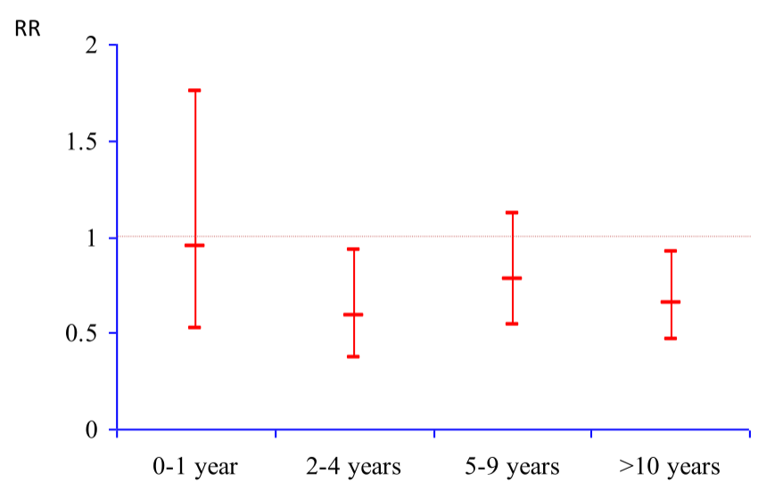
```

[@rimmVitaminConsumptionRisk1993]

# Use of vitamin supplements by US adults, 1987-2000 


```{r out.width="60%", fig.align = "center"}
knitr::include_graphics("../graphs/millen.png")
```

[@millenUseVitaminMineral2004]

# Vitamin E supplement use and risk of Coronary Heart Disease

```{r out.width="60%", fig.align = "center"}
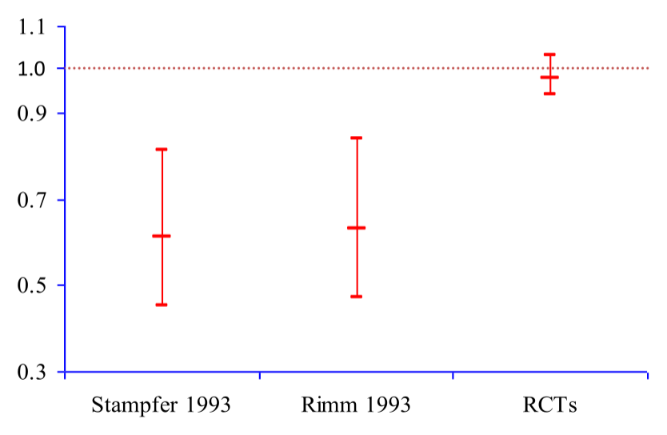
```

[@stampferVitaminConsumptionRisk1993; @rimmVitaminConsumptionRisk1993; @eidelmanRandomizedTrialsVitamin2004]

# MANY OTHER EXAMPLES {.standout}

- VITAMIN C, VITAMIN A, HRT,
- MANY DRUG TARGETS.......
- WHAT'S THE EXPLANATION?

# Vitamin E levels and confounding risk factors:

:::::::::::::: {.columns}
::: {.column width="50%"}

## Reduces Vitamin E levels

- Childhood SES [@lawlorThoseConfoundedVitamins2004]
- Manual social class
- No car access
- State pension only
- Smoker
- Obese


:::
::: {.column width="50%"}


## Increases Vitamin E levels

- Daily alcohol
- Exercise
- Low fat diet
- Height
- Leg length

:::
::::::::::::::


# Classic limitations of observational studies

:::::::::::::: {.columns}
::: {.column width="60%"}

- Confounding

```{r out.width="100%", fig.align = "center"}
knitr::include_graphics("/home/luis/Documents/OneDrive/Aulas/vcu-rmarkdown-beamer-template/graphs/image14.png")
```


:::
::: {.column width="40%"}


- Reverse causation

```{r out.width="100%", fig.align = "center"}
knitr::include_graphics("/home/luis/Documents/OneDrive/Aulas/vcu-rmarkdown-beamer-template/graphs/image11.png")
```

- Bias
```{r out.width="100%", fig.align = "center"}
knitr::include_graphics("/home/luis/Documents/OneDrive/Aulas/vcu-rmarkdown-beamer-template/graphs/image12.png")
```


:::
::::::::::::::


#  Causal inference, gold standard: randomized controlled trial [@cameliaMendelianRandomization2017]

\resizebox {\textheight} {!} {

\tikzset{every picture/.style={line width=0.75pt}} 

\begin{tikzpicture}[x=0.75pt,y=0.75pt,yscale=-1,xscale=1]
%uncomment if require: \path (0,406); %set diagram left start at 0, and has height of 406

%Shape: Rectangle [id:dp09013119193491881] 
\draw   (89.51,54.79) -- (440.51,54.79) -- (440.51,82.79) -- (89.51,82.79) -- cycle ;
%Shape: Rectangle [id:dp07466922112766006] 
\draw  [color={rgb, 255:red, 208; green, 2; blue, 27 }  ,draw opacity=1 ] (91.51,111.79) -- (439.51,111.79) -- (439.51,139.79) -- (91.51,139.79) -- cycle ;
%Shape: Rectangle [id:dp9690588436181429] 
\draw   (90,170.79) -- (172.51,170.79) -- (172.51,198.79) -- (90,198.79) -- cycle ;

%Shape: Rectangle [id:dp6239769035495455] 
\draw   (331.51,172.79) -- (440.51,172.79) -- (440.51,200.79) -- (331.51,200.79) -- cycle ;

%Shape: Rectangle [id:dp09311794295724285] 
\draw   (89.51,254.79) -- (439.51,254.79) -- (439.51,277.79) -- (89.51,277.79) -- cycle ;
%Shape: Cloud [id:dp39238737950916014] 
\draw   (195.42,186.18) .. controls (194.32,179.47) and (197.93,172.83) .. (204.72,169.07) .. controls (211.5,165.32) and (220.28,165.11) .. (227.31,168.53) .. controls (229.8,164.63) and (234.37,161.94) .. (239.62,161.27) .. controls (244.87,160.59) and (250.19,162.02) .. (253.98,165.12) .. controls (256.1,161.59) and (260.27,159.21) .. (265.01,158.84) .. controls (269.74,158.46) and (274.38,160.15) .. (277.26,163.29) .. controls (281.1,159.54) and (287.2,157.96) .. (292.93,159.24) .. controls (298.66,160.51) and (302.98,164.41) .. (304.04,169.25) .. controls (308.74,170.32) and (312.65,173.02) .. (314.77,176.67) .. controls (316.89,180.32) and (317,184.56) .. (315.08,188.28) .. controls (319.71,193.29) and (320.79,199.95) .. (317.93,205.79) .. controls (315.06,211.64) and (308.68,215.78) .. (301.15,216.67) .. controls (301.1,222.15) and (297.48,227.18) .. (291.69,229.82) .. controls (285.9,232.46) and (278.84,232.3) .. (273.23,229.4) .. controls (270.84,235.96) and (264.12,240.8) .. (255.97,241.81) .. controls (247.82,242.82) and (239.7,239.82) .. (235.12,234.12) .. controls (229.51,236.93) and (222.77,237.74) .. (216.44,236.36) .. controls (210.1,234.99) and (204.69,231.55) .. (201.43,226.81) .. controls (195.7,227.37) and (190.15,224.9) .. (187.55,220.63) .. controls (184.94,216.36) and (185.84,211.2) .. (189.78,207.71) .. controls (184.67,205.2) and (182.06,200.24) .. (183.31,195.4) .. controls (184.57,190.57) and (189.41,186.95) .. (195.31,186.44) ; \draw   (189.79,207.71) .. controls (192.2,208.89) and (194.99,209.42) .. (197.78,209.24)(201.43,226.81) .. controls (202.63,226.69) and (203.81,226.45) .. (204.93,226.08)(235.12,234.12) .. controls (234.28,233.07) and (233.57,231.94) .. (233.01,230.76)(273.23,229.4) .. controls (273.67,228.2) and (273.95,226.97) .. (274.07,225.72)(301.15,216.67) .. controls (301.21,210.83) and (297.22,205.49) .. (290.89,202.93)(315.08,188.28) .. controls (314.06,190.27) and (312.49,192.03) .. (310.51,193.43)(304.04,169.25) .. controls (304.21,170.05) and (304.29,170.87) .. (304.28,171.68)(277.26,163.29) .. controls (276.3,164.23) and (275.52,165.27) .. (274.92,166.39)(253.98,165.12) .. controls (253.47,165.97) and (253.09,166.87) .. (252.85,167.8)(227.31,168.53) .. controls (228.8,169.26) and (230.18,170.13) .. (231.41,171.13)(195.42,186.18) .. controls (195.57,187.11) and (195.81,188.02) .. (196.14,188.91) ;

%Straight Lines [id:da5448896029118211] 
\draw [line width=1.5]    (260.51,83.79) -- (260.51,108.79) ;
\draw [shift={(260.51,111.79)}, rotate = 270] [color={rgb, 255:red, 0; green, 0; blue, 0 }  ][line width=1.5]    (14.21,-4.28) .. controls (9.04,-1.82) and (4.3,-0.39) .. (0,0) .. controls (4.3,0.39) and (9.04,1.82) .. (14.21,4.28)   ;
%Straight Lines [id:da2621141017530124] 
\draw [line width=1.5]    (133.51,142.79) -- (133.51,167.79) ;
\draw [shift={(133.51,170.79)}, rotate = 270] [color={rgb, 255:red, 0; green, 0; blue, 0 }  ][line width=1.5]    (14.21,-4.28) .. controls (9.04,-1.82) and (4.3,-0.39) .. (0,0) .. controls (4.3,0.39) and (9.04,1.82) .. (14.21,4.28)   ;
%Straight Lines [id:da04700746963577296] 
\draw [line width=1.5]    (381.51,141.79) -- (381.51,166.79) ;
\draw [shift={(381.51,169.79)}, rotate = 270] [color={rgb, 255:red, 0; green, 0; blue, 0 }  ][line width=1.5]    (14.21,-4.28) .. controls (9.04,-1.82) and (4.3,-0.39) .. (0,0) .. controls (4.3,0.39) and (9.04,1.82) .. (14.21,4.28)   ;
%Straight Lines [id:da6279343979702607] 
\draw [line width=1.5]    (382.51,200.79) -- (382.51,250.79) ;
\draw [shift={(382.51,253.79)}, rotate = 270] [color={rgb, 255:red, 0; green, 0; blue, 0 }  ][line width=1.5]    (14.21,-4.28) .. controls (9.04,-1.82) and (4.3,-0.39) .. (0,0) .. controls (4.3,0.39) and (9.04,1.82) .. (14.21,4.28)   ;
%Straight Lines [id:da28108528172429614] 
\draw [line width=1.5]    (132.51,200.79) -- (132.51,250.79) ;
\draw [shift={(132.51,253.79)}, rotate = 270] [color={rgb, 255:red, 0; green, 0; blue, 0 }  ][line width=1.5]    (14.21,-4.28) .. controls (9.04,-1.82) and (4.3,-0.39) .. (0,0) .. controls (4.3,0.39) and (9.04,1.82) .. (14.21,4.28)   ;

% Text Node
\draw (204.89,60) node [anchor=north west][inner sep=0.75pt]   [align=left] {Eligible participants};
% Text Node
\draw (102.95,176) node [anchor=north west][inner sep=0.75pt]   [align=left] {Placebo};
% Text Node
\draw (349.39,178) node [anchor=north west][inner sep=0.75pt]   [align=left] {Treatment};
% Text Node
\draw (198,117) node [anchor=north west][inner sep=0.75pt]   [align=left] {Random assignment};
% Text Node
\draw (205,174) node [anchor=north west][inner sep=0.75pt]   [align=left] {{\scriptsize  \ \ \ Confounders}\\{\scriptsize on average balanced}\\{\scriptsize between groups}};
% Text Node
\draw (161,257.79) node [anchor=north west][inner sep=0.75pt]   [align=left] {Compare average outcomes};


\end{tikzpicture}
}


# The Need for Observational Studies

## Randomized Controlled Trials (RCTs):
- Not always ethical or practically feasible eg anything toxic\
- Expensive, requires experimentation in humans\
- Impractical for long follow up times\
- Should only be conducted on interventions that show very strong observational evidence in humans

## Observational studies:

- Association between environmental exposures and disease measured in observational designs (non-experimental) eg case-control studies or cohort studies

- Reliably assigning causality in these types of studies is ***very limited***


# Hierarchy of observational and experimental data


```{r out.width="90%", echo=FALSE, fig.align="center", fig.cap="Mendelian randomisation studies sit at the interface of experimental and observational studies. Their findings can be used to provide more reliable evidence to guide interventional research and provide information about potential public health interventions when a randomised controlled trial may not be feasible."}
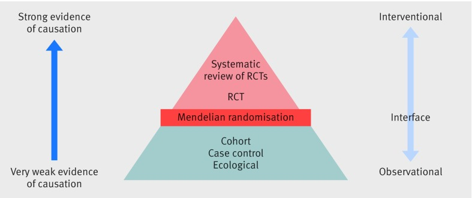
```
\scriptsize

  [@daviesReadingMendelianRandomisation2018]


# Instrumental variables

:::::::::::::: {.columns}
::: {.column width="40%"}

## Philip G Wright

```{r out.width="100%", fig.align="center"}

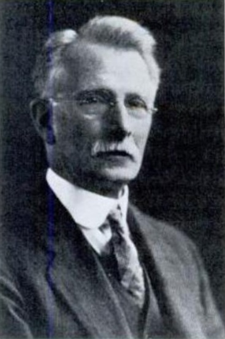

```

:::
::: {.column width="60%"}

\scriptsize

- Known for first description of the parameter identification problem
- The instrumental variables method [@timothybatesUsingModernSEMbased2022]

\scriptsize
  - Could supply and demand be derived from price/volume data? As price confounds both supply & demand, Wright deduced that to resolve them, he needed an "instrument" – Something affecting only one of demand or supply. With this, he could compute the curves he needed.

\scriptsize
  - Wright hit upon variation in rainfall. Rain didn't alter demand, but by increasing grass production, did impact butter supply. And thus the need to model food supply saw the first instrumental model conceived in 1938!
- Sewell Wright's dad!

:::
::::::::::::::

# The Wide Applicability of MR

- Traditional Observational Epidemiological Studies
- Behavior Genetics and the Social Sciences
- Molecular Studies
- Pharmacogenomics

#  {.standout}

How does Mendelian randomization work?

# What does MR do?

- Assess causal relationship between two variables
- Estimate magnitude of causal effect

## How does it do this?

- By harnessing Mendel's laws of inheritance


# Mendel's Laws of Inheritance

:::::::::::::: {.columns}
::: {.column width="40%"}

## Gregor Mendel

```{r out.width="100%"}
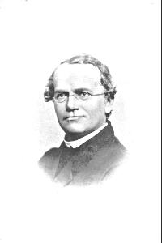
```

:::
::: {.column width="60%"}

## Mendel's Laws of Inheritance

1. Segregation: alleles separate at meiosis and a randomly selected allele is transmitted to offspring
2. Independent assortment: alleles for separate traits are transmitted independently of one another

- Mendel in 1862

:::
::::::::::::::

# Meiosis

:::::::::::::: {.columns}
::: {.column width="40%"}

```{r out.width="80%", fig.align="center"}
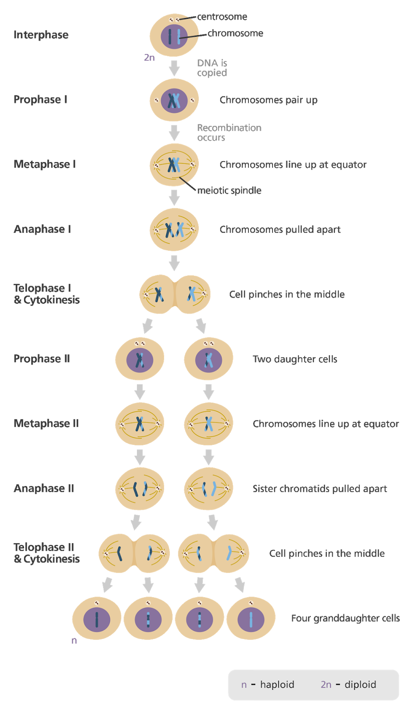
```

:::
::: {.column width="60%"}

- Two cell divisions
- Produces four daughter cells
- Produces haploid cells
- Daughter cells are non-identical
- Produces sex cells
- Crossing-over occurs
- Homologous chromosomes pair up 
  - and are separated at random (independent segregation)

:::
::::::::::::::


# Genetic variant as an instrument

> The genotype only affects the disease status indirectly and is assigned randomly (given the parents' genes) at
meiosis, independently of the possible confounding factors. It is well known in the econometrics and causal literature, and slowly being recognized in the epidemiological
literature that these properties define an instrumental variable (IV) [@didelezMendelianRandomizationInstrumental2007]

# Analogy RCT -  Mendelian Randomization [@cameliaMendelianRandomization2017; @costetPCSK9LDLCholesterol2008]


\resizebox {\textheight} {!} {


\tikzset{every picture/.style={line width=0.75pt}} %set default line width to 0.75pt        

\begin{tikzpicture}[x=0.75pt,y=0.75pt,yscale=-1,xscale=1]
%uncomment if require: \path (0,406); %set diagram left start at 0, and has height of 406

%Shape: Rectangle [id:dp09013119193491881] 
\draw  [color={rgb, 255:red, 0; green, 0; blue, 0 }  ,draw opacity=1 ] (89.51,69.79) -- (301.02,69.79) -- (301.02,93.04) -- (89.51,93.04) -- cycle ;
%Shape: Rectangle [id:dp1138343991777091] 
\draw  [color={rgb, 255:red, 0; green, 0; blue, 0 }  ,draw opacity=1 ] (89.02,111.79) -- (301.41,111.79) -- (301.41,132.74) -- (89.02,132.74) -- cycle ;
%Shape: Rectangle [id:dp9690588436181429] 
\draw  [color={rgb, 255:red, 0; green, 0; blue, 0 }  ,draw opacity=1 ] (91.02,156.56) -- (190.02,156.56) -- (190.02,178.04) -- (91.02,178.04) -- cycle ;

%Shape: Rectangle [id:dp6239769035495455] 
\draw  [color={rgb, 255:red, 0; green, 0; blue, 0 }  ,draw opacity=1 ] (193.02,156.45) -- (301.26,156.45) -- (301.26,178.29) -- (193.02,178.29) -- cycle ;

%Straight Lines [id:da45788790072527963] 
\draw [color={rgb, 255:red, 0; green, 0; blue, 0 }  ,draw opacity=1 ][line width=1.5]    (141.15,133.99) -- (141.15,151.95) ;
\draw [shift={(141.15,154.95)}, rotate = 270] [color={rgb, 255:red, 0; green, 0; blue, 0 }  ,draw opacity=1 ][line width=1.5]    (14.21,-4.28) .. controls (9.04,-1.82) and (4.3,-0.39) .. (0,0) .. controls (4.3,0.39) and (9.04,1.82) .. (14.21,4.28)   ;
%Straight Lines [id:da7866948802592717] 
\draw [color={rgb, 255:red, 0; green, 0; blue, 0 }  ,draw opacity=1 ][line width=1.5]    (245.29,134.24) -- (245.29,152.2) ;
\draw [shift={(245.29,155.2)}, rotate = 270] [color={rgb, 255:red, 0; green, 0; blue, 0 }  ,draw opacity=1 ][line width=1.5]    (14.21,-4.28) .. controls (9.04,-1.82) and (4.3,-0.39) .. (0,0) .. controls (4.3,0.39) and (9.04,1.82) .. (14.21,4.28)   ;
%Shape: Rectangle [id:dp4127490584755418] 
\draw  [color={rgb, 255:red, 0; green, 0; blue, 0 }  ,draw opacity=1 ] (91.02,200.56) -- (189.02,200.56) -- (189.02,222.04) -- (91.02,222.04) -- cycle ;
%Shape: Rectangle [id:dp4735789734124094] 
\draw  [color={rgb, 255:red, 0; green, 0; blue, 0 }  ,draw opacity=1 ] (192.02,200.45) -- (300.26,200.45) -- (300.26,222.29) -- (192.02,222.29) -- cycle ;
%Shape: Rectangle [id:dp28769473574519955] 
\draw  [color={rgb, 255:red, 0; green, 0; blue, 0 }  ,draw opacity=1 ] (91.02,243.56) -- (190.11,243.56) -- (190.11,265.04) -- (91.02,265.04) -- cycle ;

%Shape: Rectangle [id:dp14544770880087965] 
\draw  [color={rgb, 255:red, 0; green, 0; blue, 0 }  ,draw opacity=1 ] (192.02,243.45) -- (300.26,243.45) -- (300.26,265.29) -- (192.02,265.29) -- cycle ;
%Straight Lines [id:da472233837345017] 
\draw [color={rgb, 255:red, 0; green, 0; blue, 0 }  ,draw opacity=1 ][line width=1.5]    (139.15,178.99) -- (139.15,196.95) ;
\draw [shift={(139.15,199.95)}, rotate = 270] [color={rgb, 255:red, 0; green, 0; blue, 0 }  ,draw opacity=1 ][line width=1.5]    (14.21,-4.28) .. controls (9.04,-1.82) and (4.3,-0.39) .. (0,0) .. controls (4.3,0.39) and (9.04,1.82) .. (14.21,4.28)   ;
%Straight Lines [id:da390269523331114] 
\draw [color={rgb, 255:red, 0; green, 0; blue, 0 }  ,draw opacity=1 ][line width=1.5]    (243.29,179.24) -- (243.29,197.2) ;
\draw [shift={(243.29,200.2)}, rotate = 270] [color={rgb, 255:red, 0; green, 0; blue, 0 }  ,draw opacity=1 ][line width=1.5]    (14.21,-4.28) .. controls (9.04,-1.82) and (4.3,-0.39) .. (0,0) .. controls (4.3,0.39) and (9.04,1.82) .. (14.21,4.28)   ;
%Straight Lines [id:da23267534581244886] 
\draw [color={rgb, 255:red, 0; green, 0; blue, 0 }  ,draw opacity=1 ][line width=1.5]    (140.15,221.99) -- (140.15,239.95) ;
\draw [shift={(140.15,242.95)}, rotate = 270] [color={rgb, 255:red, 0; green, 0; blue, 0 }  ,draw opacity=1 ][line width=1.5]    (14.21,-4.28) .. controls (9.04,-1.82) and (4.3,-0.39) .. (0,0) .. controls (4.3,0.39) and (9.04,1.82) .. (14.21,4.28)   ;
%Straight Lines [id:da8559200544433885] 
\draw [color={rgb, 255:red, 0; green, 0; blue, 0 }  ,draw opacity=1 ][line width=1.5]    (244.29,222.24) -- (244.29,240.2) ;
\draw [shift={(244.29,243.2)}, rotate = 270] [color={rgb, 255:red, 0; green, 0; blue, 0 }  ,draw opacity=1 ][line width=1.5]    (14.21,-4.28) .. controls (9.04,-1.82) and (4.3,-0.39) .. (0,0) .. controls (4.3,0.39) and (9.04,1.82) .. (14.21,4.28)   ;
%Shape: Rectangle [id:dp15823606977740523] 
\draw  [color={rgb, 255:red, 208; green, 2; blue, 27 }  ,draw opacity=1 ] (314.51,69.79) -- (526.02,69.79) -- (526.02,93.04) -- (314.51,93.04) -- cycle ;
%Shape: Rectangle [id:dp21435354228682013] 
\draw  [color={rgb, 255:red, 208; green, 2; blue, 27 }  ,draw opacity=1 ] (314.02,111.79) -- (526.41,111.79) -- (526.41,132.74) -- (314.02,132.74) -- cycle ;
%Shape: Rectangle [id:dp8738351049153021] 
\draw  [color={rgb, 255:red, 208; green, 2; blue, 27 }  ,draw opacity=1 ] (316.02,156.56) -- (415.02,156.56) -- (415.02,178.04) -- (316.02,178.04) -- cycle ;
%Shape: Rectangle [id:dp45776597282535114] 
\draw  [color={rgb, 255:red, 208; green, 2; blue, 27 }  ,draw opacity=1 ] (418.02,156.45) -- (526.26,156.45) -- (526.26,178.29) -- (418.02,178.29) -- cycle ;
%Straight Lines [id:da5975721940524428] 
\draw [color={rgb, 255:red, 208; green, 2; blue, 27 }  ,draw opacity=1 ][line width=1.5]    (366.15,133.99) -- (366.15,151.95) ;
\draw [shift={(366.15,154.95)}, rotate = 270] [color={rgb, 255:red, 208; green, 2; blue, 27 }  ,draw opacity=1 ][line width=1.5]    (14.21,-4.28) .. controls (9.04,-1.82) and (4.3,-0.39) .. (0,0) .. controls (4.3,0.39) and (9.04,1.82) .. (14.21,4.28)   ;
%Straight Lines [id:da9671220095737316] 
\draw [color={rgb, 255:red, 208; green, 2; blue, 27 }  ,draw opacity=1 ][line width=1.5]    (470.29,134.24) -- (470.29,152.2) ;
\draw [shift={(470.29,155.2)}, rotate = 270] [color={rgb, 255:red, 208; green, 2; blue, 27 }  ,draw opacity=1 ][line width=1.5]    (14.21,-4.28) .. controls (9.04,-1.82) and (4.3,-0.39) .. (0,0) .. controls (4.3,0.39) and (9.04,1.82) .. (14.21,4.28)   ;
%Shape: Rectangle [id:dp5030193252802866] 
\draw  [color={rgb, 255:red, 208; green, 2; blue, 27 }  ,draw opacity=1 ] (316.02,200.56) -- (414.02,200.56) -- (414.02,222.04) -- (316.02,222.04) -- cycle ;
%Shape: Rectangle [id:dp9701059530643161] 
\draw  [color={rgb, 255:red, 208; green, 2; blue, 27 }  ,draw opacity=1 ] (417.02,200.45) -- (525.26,200.45) -- (525.26,222.29) -- (417.02,222.29) -- cycle ;
%Shape: Rectangle [id:dp6689503147345437] 
\draw  [color={rgb, 255:red, 208; green, 2; blue, 27 }  ,draw opacity=1 ] (316.02,243.56) -- (415.11,243.56) -- (415.11,265.04) -- (316.02,265.04) -- cycle ;

%Shape: Rectangle [id:dp5411042648591329] 
\draw  [color={rgb, 255:red, 208; green, 2; blue, 27 }  ,draw opacity=1 ] (417.02,243.45) -- (525.26,243.45) -- (525.26,265.29) -- (417.02,265.29) -- cycle ;
%Straight Lines [id:da7154750287536058] 
\draw [color={rgb, 255:red, 208; green, 2; blue, 27 }  ,draw opacity=1 ][line width=1.5]    (364.15,178.99) -- (364.15,196.95) ;
\draw [shift={(364.15,199.95)}, rotate = 270] [color={rgb, 255:red, 208; green, 2; blue, 27 }  ,draw opacity=1 ][line width=1.5]    (14.21,-4.28) .. controls (9.04,-1.82) and (4.3,-0.39) .. (0,0) .. controls (4.3,0.39) and (9.04,1.82) .. (14.21,4.28)   ;
%Straight Lines [id:da7914968688037842] 
\draw [color={rgb, 255:red, 208; green, 2; blue, 27 }  ,draw opacity=1 ][line width=1.5]    (468.29,179.24) -- (468.29,197.2) ;
\draw [shift={(468.29,200.2)}, rotate = 270] [color={rgb, 255:red, 208; green, 2; blue, 27 }  ,draw opacity=1 ][line width=1.5]    (14.21,-4.28) .. controls (9.04,-1.82) and (4.3,-0.39) .. (0,0) .. controls (4.3,0.39) and (9.04,1.82) .. (14.21,4.28)   ;
%Straight Lines [id:da95323390220036] 
\draw [color={rgb, 255:red, 208; green, 2; blue, 27 }  ,draw opacity=1 ][line width=1.5]    (365.15,221.99) -- (365.15,239.95) ;
\draw [shift={(365.15,242.95)}, rotate = 270] [color={rgb, 255:red, 208; green, 2; blue, 27 }  ,draw opacity=1 ][line width=1.5]    (14.21,-4.28) .. controls (9.04,-1.82) and (4.3,-0.39) .. (0,0) .. controls (4.3,0.39) and (9.04,1.82) .. (14.21,4.28)   ;
%Straight Lines [id:da3219069749771628] 
\draw [color={rgb, 255:red, 208; green, 2; blue, 27 }  ,draw opacity=1 ][line width=1.5]    (469.29,222.24) -- (469.29,240.2) ;
\draw [shift={(469.29,243.2)}, rotate = 270] [color={rgb, 255:red, 208; green, 2; blue, 27 }  ,draw opacity=1 ][line width=1.5]    (14.21,-4.28) .. controls (9.04,-1.82) and (4.3,-0.39) .. (0,0) .. controls (4.3,0.39) and (9.04,1.82) .. (14.21,4.28)   ;

% Text Node
\draw (102.51,72.79) node [anchor=north west][inner sep=0.75pt]   [align=left] {Randomized controlled trial};
% Text Node
\draw (112.15,158.58) node [anchor=north west][inner sep=0.75pt]   [align=left] {Placebo};
% Text Node
\draw (210.53,158.65) node [anchor=north west][inner sep=0.75pt]   [align=left] {Treatment};
% Text Node
\draw (127.57,113.55) node [anchor=north west][inner sep=0.75pt]   [align=left] {Random assignment};
% Text Node
\draw (93.27,203.58) node [anchor=north west][inner sep=0.75pt]   [align=left] {Higher LDL-c};
% Text Node
\draw (200.27,203.58) node [anchor=north west][inner sep=0.75pt]   [align=left] {Lower LDL-c};
% Text Node
\draw (90.19,246.58) node [anchor=north west][inner sep=0.75pt]   [align=left] {Higher HD risk };
% Text Node
\draw (197.02,246.45) node [anchor=north west][inner sep=0.75pt]   [align=left] {Lower HD risk };
% Text Node
\draw (356.51,72.79) node [anchor=north west][inner sep=0.75pt]   [align=left] {MR: Nature's RCT};
% Text Node
\draw (352.57,113.55) node [anchor=north west][inner sep=0.75pt]   [align=left] {Random inheritance};
% Text Node
\draw (321.27,203.58) node [anchor=north west][inner sep=0.75pt]   [align=left] {Higher LDL-c};
% Text Node
\draw (425.27,203.58) node [anchor=north west][inner sep=0.75pt]   [align=left] {Lower LDL-c};
% Text Node
\draw (422.02,246.45) node [anchor=north west][inner sep=0.75pt]   [align=left] {Lower HD risk };
% Text Node
\draw (315.19,246.58) node [anchor=north west][inner sep=0.75pt]   [align=left] {Higher HD risk };
% Text Node
\draw (339.02,159.56) node [anchor=north west][inner sep=0.75pt]   [align=left] {PCSK9 -};
% Text Node
\draw (443.53,159.65) node [anchor=north west][inner sep=0.75pt]   [align=left] {PCSK9 +};


\end{tikzpicture}

}


# Similarities MR - RCT

```{r echo=FALSE,  fig.align='center', out.width='70%'}
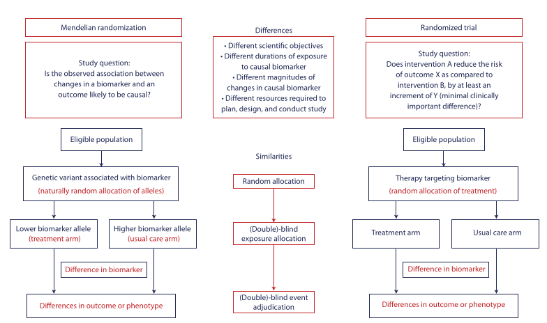
```

[@ferenceUsingMendelianRandomization2021]

# Similarities MR - RCT [@sandersonMendelianRandomizationNature2022]

```{r echo=FALSE,  fig.align='center', out.width='60%', fig.cap="Illustration of a randomized control study and instrumental variable estimation. A randomized controlled trial (RCT) (panel a) and a Mendelian randomization (MR) study (panel b) to estimate the effect of lowering C-reactive protein (CRP) on systolic blood pressure (SBP). The arrows highlighted in red show the causal effect of interest."}
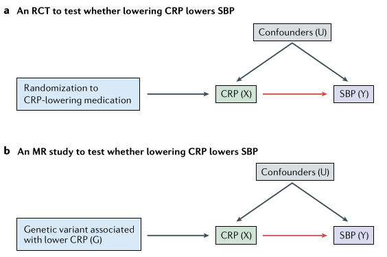
```


# Mendelian randomization  


- Uses genetic variants as instrumental variables [@richmondMendelianRandomizationConcepts2022]
- Helps understand causation, but has strong assumptions [@sandersonMendelianRandomizationNature2022]
  1. G (instrument) is robustly associated with X (“relevance”);
  2. G does not share common causes (C) with Y (Outcome) (“independence” or “exchangeability”); and
  3. G affects Y exclusively through its effect on X (“exclusion restriction”).
  4. No bidirectional causation between X and Y

```{r echo=FALSE,  fig.align='center', out.width='60%'}
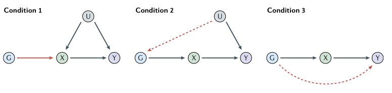
```


# Mendelian Randomization 

  - Depends on intruments sufficiently predictive of exposure [@richmondMendelianRandomizationConcepts2022]
  - Psychiatric disorders polygenicity, weak instrument bias
  - Cause is  (typically) assessed in one direction

\vspace{3mm}

```{r out.width="100%", warning = F}
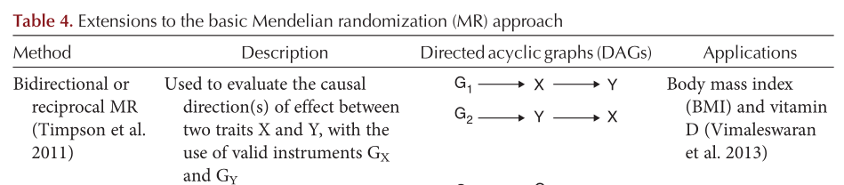
```


# Why are genetic associations special?

- Robustness to confounding due to Mendel's laws:
  - Law of segregation: inheritance of an allele is random and independent of environment etc
  - Law of independent assortment: genes for different traits segregate independently (assuming not in LD)
- The direction of causality is known -- always from SNP to trait
- Genetic variants are **potentially** very good instrumental variables
- Using genetic variants as IVs is a special case of IV analysis, known as Mendelian randomization

# Calculating causal effect estimates

```{r out.width="100%", warning = F}
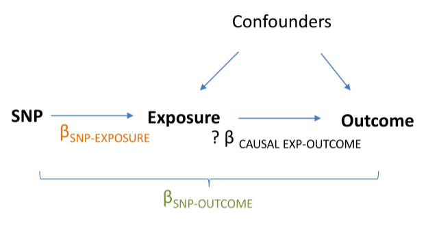
```

- After SNP identified associated with exposure of interest
  - Wald estimator
  - Two-stage least-squares (2SLS) regression

# Two-stage least squares (2SLS)

- Stage 1: regress exposure on instrument and get predicted
values

\vspace{3mm}

- Stage 2: use predicted exposure to predict the outcome

# Two-stage least squares (2SLS) [@cameliaMendelianRandomization2017]

## Stage 1

$$X_i = \beta_0 + \beta_1*GV_i + \epsilon_i$$

- Regress exposure on GV & obtain **predicted** values

## Stage 2

$$Y_i = g_0 + g_1*\hat{X}_i + \epsilon_i$$

- Regress outcome on predicted exposure

$g_1$
: difference in outcome per unit change in (genetically-predicted) exposure

\tiny

- needs to be done in one  sample


# The Wald estimator 

```{r out.width="100%", warning = F}
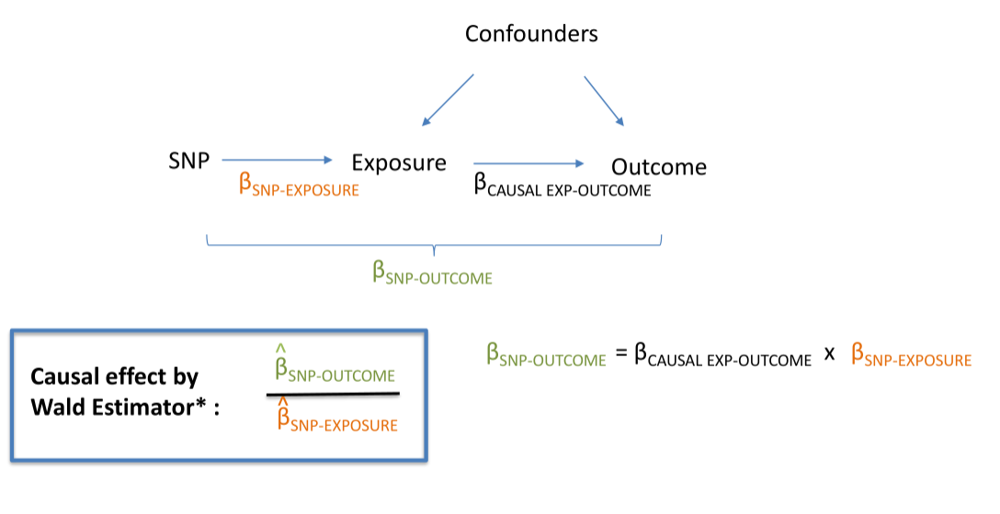
```

\tiny

- can be used in different samples

# The Wald estimator 

```{r out.width="100%", warning = F}
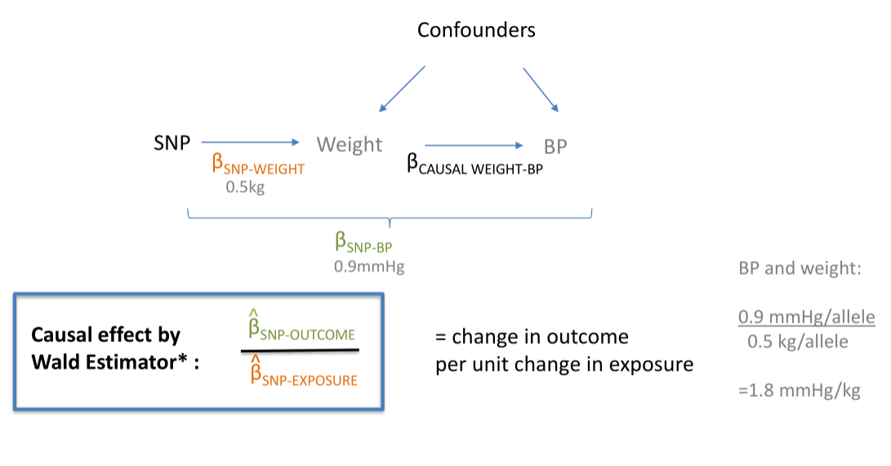
```

# MR can also be performed using just the results from GWAS

- Also known as two-sample MR, SMR, or MR with summary data etc
- Advantages:
  - The data is readily available, non-disclosive, free, open source
  - The exposure and outcome might not be measured in the same sample
  - The sample size of the outcome variable, key to statistical power, is not limited by requiring overlapping measures of the exposure
- Disadvantages:
  - Some extensions of MR not possible, e.g. non-linear MR, use of GxE for negative controls, various sensitivity analyses

# One-sample vs Two-sample MR designs

```{r out.width="45%", warning = F, fig.cap=" (A) One-sample MR uses a data set in which genotype, exposure, and outcome have been assessed. (B) Two-sample MR uses a genetic data set in which the exposure has been measured (to derive SNP-exposure estimates, sample 1) and a second genetic data set in which the outcome has been measured (to derive SNP-outcome estimates, sample 2)."}
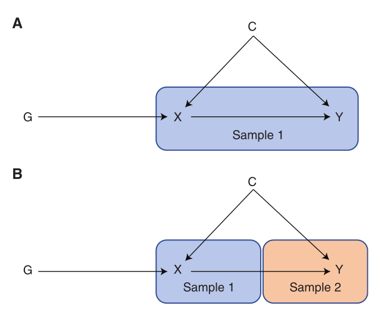
```
\scriptsize
[@richmondMendelianRandomizationConcepts2022]

# {.standout}

An Example using Mendelian randomization

# MR Example using CRP


- C-Reactive Protein (CRP) is a biomarker of inflammation
- It is associated with BMI, metabolic syndrome, CHD and a number of other diseases
- It is unclear whether these observational relationships are causal or due to confounding or reverse causality
- This question is important from the perspective of intervention and drug development

# Bi-directional MR

:::::::::::::: {.columns}
::: {.column width="50%"}

- Only achieved by running twice [@timpsonCreactiveProteinLevels2011]

```{r out.width="100%", warning = F}
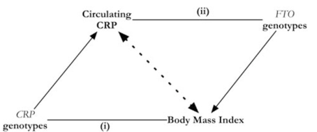
```
:::
::: {.column width="50%"}

```{r out.width="100%", warning = F, fig.cap="Comparison of linear relationships between residual BMI and circulating CRP observationally and when estimated using the CRP locus rs3091244 as an instrument for log-transformed CRP"}
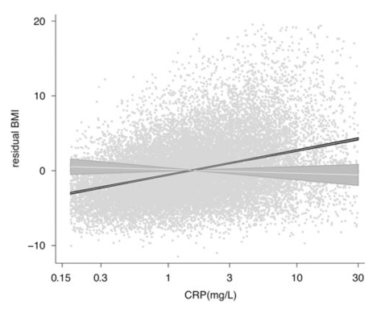
```


:::
::::::::::::::

# Limitations to Mendelian randomization

1. Population stratification
1. The existence of instruments
1. Power and "weak instrument bias"
1. Pleiotropy


# Dynastic effect, assortative mating and pop structure

:::::::::::::: {.columns}
::: {.column width="60%"}


```{r out.width="100%", warning = F}
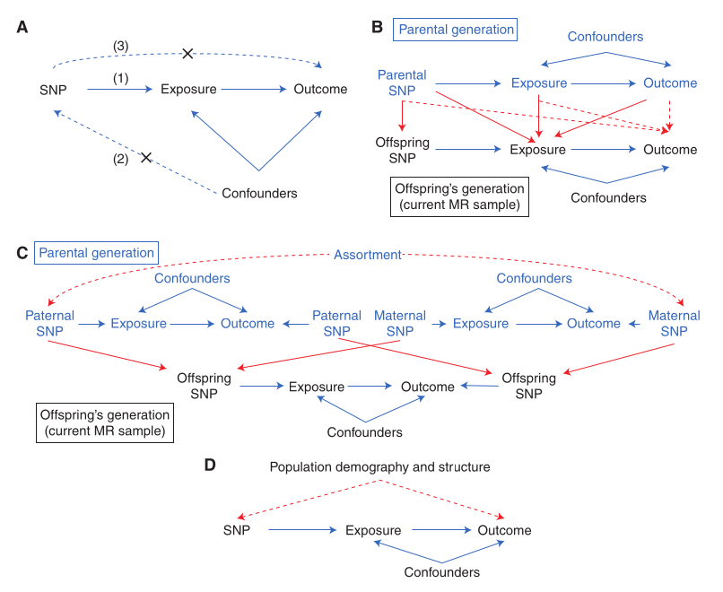
```

:::
::: {.column width="40%"}

\scriptsize

The solid blue arrows represent relationships within an individual (e.g., the effects of offspring single-nucleotide polymorphisms [SNPs] on offspring exposure). The red lines represent the effects of relationships between individuals (e.g., the direct effects of parents’ phenotypes on their children). B, dynastic effects; C, cross-trait assortative mating (educated females and tall men); D, population structure [@hwangIntegratingFamilyBasedMendelian2021]


:::
::::::::::::::

# Power and Weak Instruments

- Power:
  - Genetic variants explain very small amounts of phenotypic variance in a given trait
  - VERY large sample sizes are generally required
- Weak instruments:
  - Genetic variants that are weak proxies for the exposure.
  - Results in biased causal estimates from MR 
- Different impact of the bias from weak instruments:
  - **Single Sample MR:** to the confounded estimate
  - **Two-Sample MR:** to the null


# Using Multiple Genetic Variants as Instruments


```{r out.width="90%", warning = F}
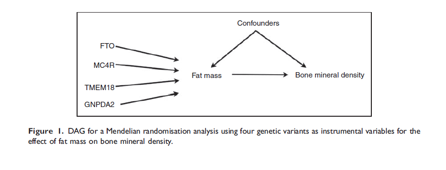
```
\small

- Allelic scores [@palmerUsingMultipleGenetic2012]
- Testing multiple variants individually
- Meta-analyze individual SNPs

# Calculating Power in Mendelian Randomization Studies [@brionCalculatingStatisticalPower2013]


```{r out.width="80%", warning = F}
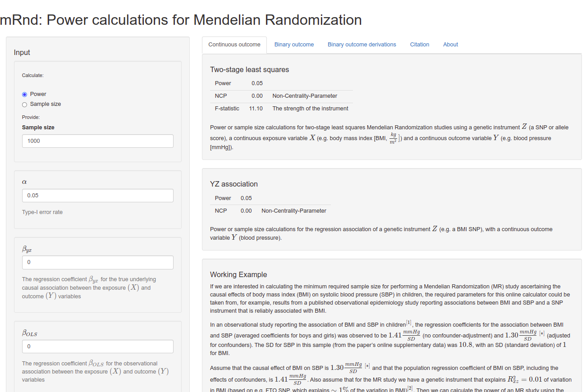
```

# Pleiotropy is pervasive 

:::::::::::::: {.columns}
::: {.column width="60%"}


- Genetic variant influences more than one trait
- Horizontal vs Vertical pleiotropy
  - It has a central role in the genetic architecture [@jordanHOPSQuantitativeScore2019]
  - Using MR-PRESSO found pleiotropy in over 48% of significant MR [@verbanckDetectionWidespreadHorizontal2018], with large distortions on MR estimates.

:::
::: {.column width="40%"}

```{r out.width="100%", warning = F}
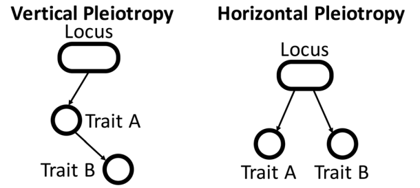
```
```{r out.width="100%", warning = F, fig.cap="(LD) and polygenicity are expected to contribute to horizontal pleiotropy"}
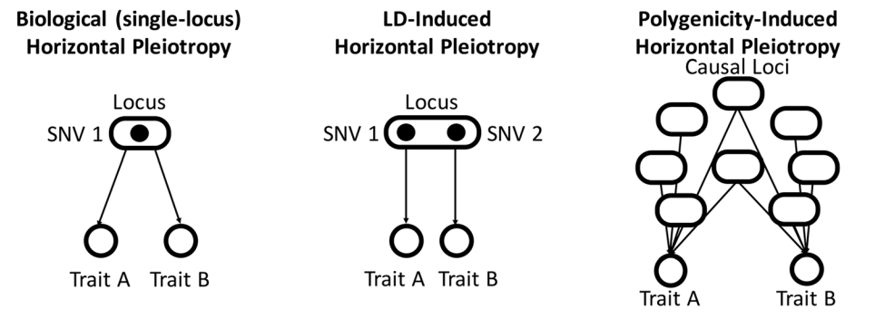
```


:::
::::::::::::::

# Linkage disequilibrium

```{r out.width="100%", warning = F, fig.align="center", fig.cap="a | An example of distinct causal variants that violate the instrumental variable assumption IV2. G1 and G2 represent two genetic variants and the link between them is non-directional, reflecting linkage disequilibrium. b,c | Examples of a shared causal variant are a violation of assumption IV2 (panel b) and a situation that satisfies the IV assumptions (panel c)."}
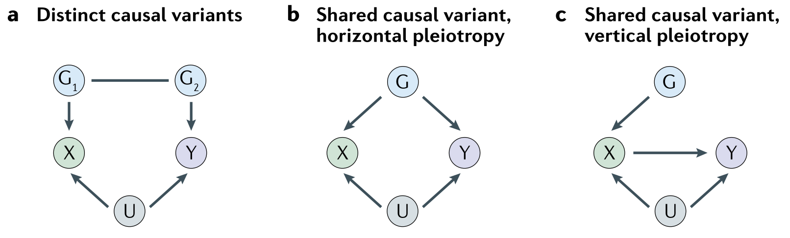
```


#
\section{Sensitivity analysis in MR}


# Intro

- Inverse variance weighted MR (unbiased estimator, but no pleiotropy assumption)
  - Heterogeneity tests         
  - Multivariable MR            
  - MR Egger                    

# Inverse variance weighted (IVW) fixed effects method

:::::::::::::: {.columns}
::: {.column width="50%"}


- There is one underlying 'true' effect
- All deviations of sample effects from the 'true' effect are due to chance

- For N studies, each study i contributes more to the meta-analysis if its standard error is lower

:::
::: {.column width="50%"}


$$
w_i=\frac{1}{\operatorname{var}\left(\beta_i\right)}
$$

$$
\beta_{\text {pooled }}=\frac{\sum_{i=1}^N\left(w_i * \beta_i\right)}{\sum_{i=1}^N\left(w_i\right)}
$$

$$
s e_{\text {pooled }}=\sqrt{\frac{1}{\sum_{i=1}^N\left(w_i\right)}}
$$

:::
::::::::::::::


# Calculate the p-value

$$
\chi_{d f=1}^2=\frac{\beta_{\text {pooled }}^2}{s e_{\text {pooled }}^2}=\frac{\left(\sum_{i=1}^N w_i * \beta_i\right)^2}{\sum_{i=1}^N w_i}
$$

$$
z=\frac{\beta_{\text {pooled }}}{s e_{\text {pooled }}}=\frac{\sum_{i=1}^N w_i * \beta_i}{\sqrt{\sum_{i=1}^N w_i}}
$$

# Fixed Effects IVW-MR and Weighted Linear regression

:::::::::::::: {.columns}
::: {.column width="50%"}


```{r out.width="100%"}
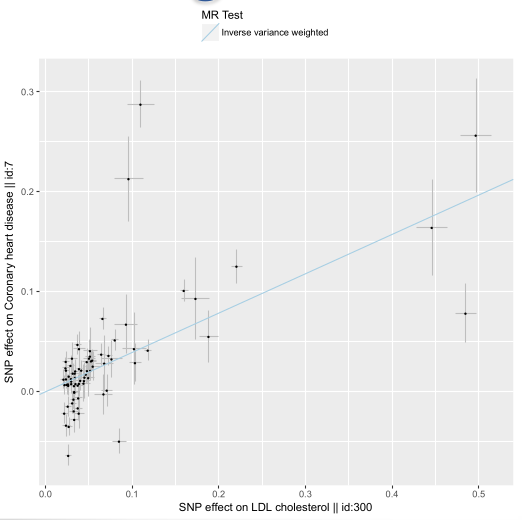
```

:::
::: {.column width="50%"}

- IVW is equivalent to a weighted regression
of SNP-outcome effects on SNP-exposure
effects passing through the origin
- The weights are the inverse of the variance
of the individual causal effect estimates
- The slope is the estimate of the causal effect

```{r out.width="60%", fig.align="center"}
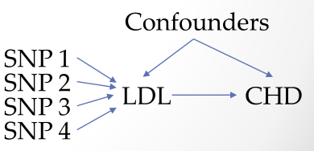
```

:::
::::::::::::::

# MR methods for handling horizontal pleiotropy 
## What is the problem?


- Mendelian Randomization (MR) uses genetic variants to test for causal relationships between phenotypic exposures and disease-related outcomes                                       
- Due to the proliferation of GWAS, it is increasingly common for MR analyses to use large numbers of genetic variants
- Increased power but greater potential for **pleiotropy**  
- Pleiotropic variants affect biological pathways other than the  exposure under investigation and therefore can lead to biased causal estimates and false positives under the null     

# Two Sample MR:
:::::::::::::: {.columns}
::: {.column width="50%"}
## Single Variants


```{r out.width="100%", warning = F}
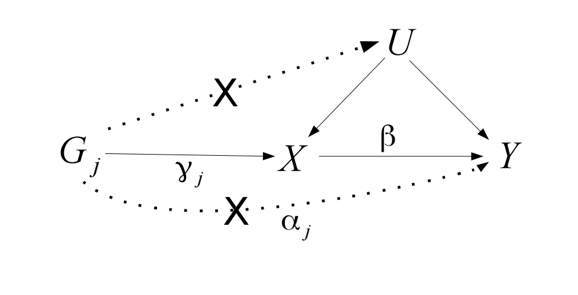
```

:::
::: {.column width="50%"}

$$\text{Wald} = \frac{\text{Beta-GY}}{\text{Beta-GX}}$$

- Causal estimate using Wald method: $\frac{\beta \gamma_j}{\gamma_j}=\beta$

:::
::::::::::::::


# Two Sample MR:

:::::::::::::: {.columns}
::: {.column width="50%"}

## Multiple Variants

```{r out.width="100%", warning = F}

```


:::
::: {.column width="50%"}

- Causal estimate using IVW from summarised data: $\frac{\sum_{j=1}^J \hat{\gamma}_j^2 \sigma_{Y j}^{-2} \hat{\beta}_j}{\sum_{j=1}^J \hat{\gamma}_j^2 \sigma_{Y j}^{-2}}=\beta$

(Approximates TSLS)

```{r out.width="100%", warning = F}
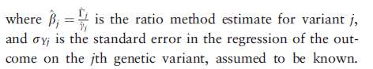
```

:::
::::::::::::::

# MR with direct pleiotropy

:::::::::::::: {.columns}
::: {.column width="50%"}


```{r out.width="100%", warning = F}
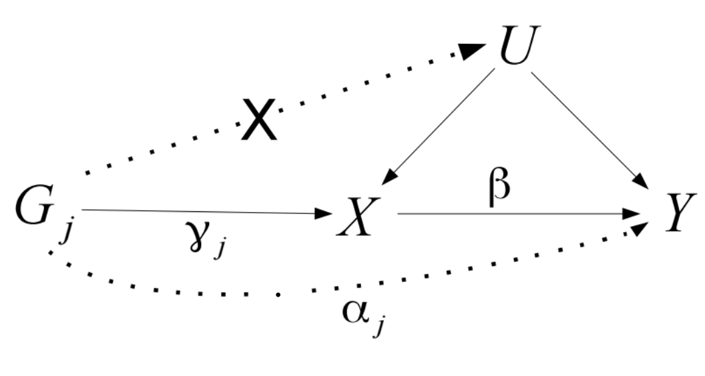
```


:::
::: {.column width="50%"}

$$
\begin{aligned}
Y_i &=\Gamma_j G_{i j}+\epsilon_{i j}^{\prime Y} \\
&=\left(\alpha_j+\beta \gamma_j\right) G_{i j}+\epsilon_{i j}^{\prime Y} .
\end{aligned}
$$

Single variant Wald estimate: $\beta_j=\beta+\frac{\alpha_j}{\gamma_j}$

Multiple variant:

$$
\beta+\frac{\sum_{j=1}^J \gamma_j \sigma_{Y j}^{-2} \alpha_j}{\sum_{j=1}^J \gamma_j^2 \sigma_{Y j}^{-2}}=\beta+\operatorname{Bias}(\alpha, \gamma)
$$


:::
::::::::::::::

# Heterogeneity

:::::::::::::: {.columns}
::: {.column width="50%"}

\scriptsize

- We expect that each SNP represents an independent study, and each
should give an unbiased (if imprecise) estimate of the causal effect
of x on y

- Heterogeneity, where effect estimates are more different than expected
due to standard errors, arises because at least some of the
instruments are invalid

- Cochran's Q statistic

$$
Q=\sum_{k=1}^K w_k\left(\hat{\beta}_k-\hat{\beta}_{I V W}\right)^2
$$

:::
::: {.column width="50%"}

```{r out.width="100%", warning = F}
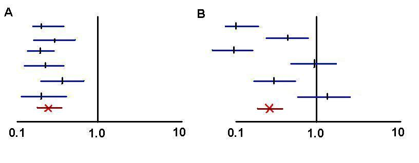
```

\scriptsize

- n=6 instruments
- Expect Q = 5 if there is no heterogeneity
- Q is chi-square distributed with n-1 degrees of freedom


:::
::::::::::::::


# Option 1: Remove outliers

:::::::::::::: {.columns}
::: {.column width="60%"}


- Some SNPs might contribute to the majority of the heterogeneity
- If we assume these are the invalid instruments then the IVW estimate excluding them should be less biased
- However, beware of:
  -  Cherry picking, remove outliers will artificially provide a more precise estimate
  - What if the outlier is the only valid instrument, and all the others are invalid?

:::
::: {.column width="40%"}


```{r out.width="100%", warning = F}
knitr::include_graphics("../graphs/image61.png")
```
:::
::::::::::::::


#  Option 2: Multivariable MR

:::::::::::::: {.columns}
::: {.column width="50%"}

- We are testing for whether X1 has an influence on Y  [@sandersonMendelianRandomizationNature2022] 
- We know that some instruments for X1 also have influences on X2           
- This opens up the possibility of horizontal pleiotropy
biasing our estimate                                    
- What is the X1-Y association adjusting for X2?        

:::
::: {.column width="50%"}


```{r out.width="100%", warning = F, fig.align="center", fig.cap="Multivariable Mendelian randomization (MR) for three genetic variants (G1, G2, G3), two exposures (X1, X2) and an outcome Y. Confounders U1 and U2 are assumed to be unknown."}
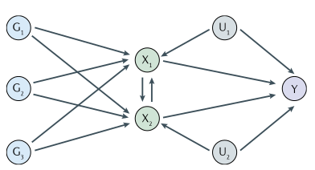
```
:::
::::::::::::::

# Option 3: Fit a model that is robust to  horizontal pleiotropy

-  IVW fixed effects estimate assumes all SNPs are valid instruments, and averages across them all

- IVW random effects model allows all SNPs to be drawn from a different
distribution -- the estimate is the same but the standard error is
larger if there is any heterogeneity


# {.standout}

MR Egger Regression

# MR Egger Regression: Central concept

- In Mendelian Randomization when multiple genetic variants are being used as IVs, Egger regression can:
  - Identify the presence of direct horizontal pleiotropy (biasing the IV estimate)
  - provide a less biased causal estimate (in the presence of pleiotropy)
- However, MR Egger lacks power

# InSIDE Assumption


:::::::::::::: {.columns}
::: {.column width="50%"}

## Relaxing MR's assumptions

\scriptsize 

> We explore the condition that the correlation between the genetic associations with the exposure (the $\gamma_j$ parameters) and the direct effects of the genetic variants on the outcome (the $\alpha_j$ parameters) is zero. We refer to the condition that the distributions of these parameters are independent as InSIDE (Instrument Strenght Independent of Direct Effect). It can be viewed as a weaker version of the exclusion restriction assumption.

:::
::: {.column width="50%"}


```{r out.width="100%", warning = F}
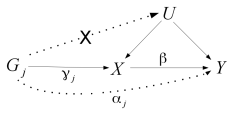
```

$$
\begin{aligned}
Y_i &=\Gamma_j G_{i j}+\epsilon_{i j}^{\prime Y} \\
&=\left(\alpha_j+\beta \gamma_j\right) G_{i j}+\epsilon_{i j}^{\prime Y}
\end{aligned}
$$

:::
::::::::::::::

# All invalid instruments inside assumption satisfied

## SNP – exposure association

```{r out.width="70%", warning = F}
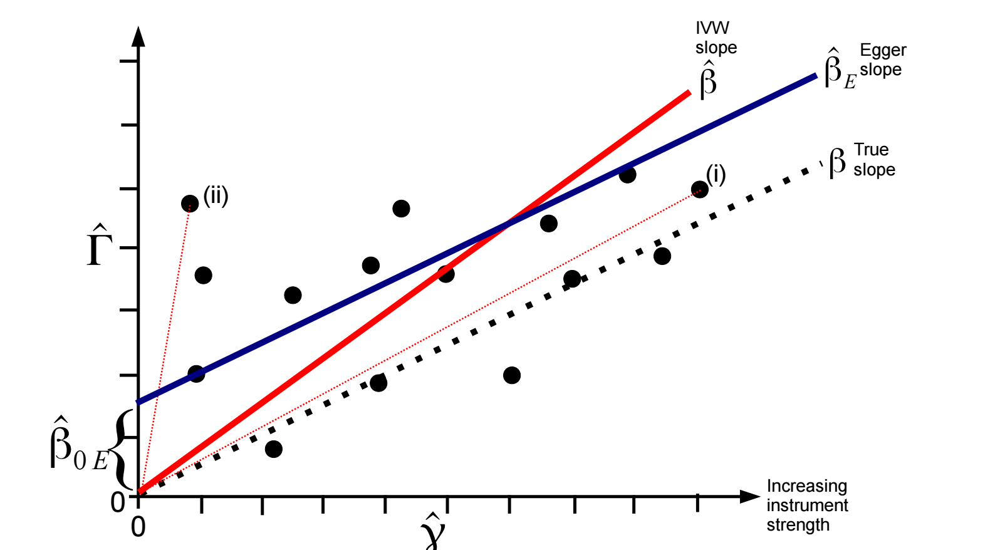
```

# Statistical significanc of intercept, indication of pleiotropy 

:::::::::::::: {.columns}
::: {.column width="50%"}

- Intercept not constrained to zero $\hat{\Gamma}_j=\beta_{0 E}+\beta_E \hat{\gamma}_j$

```{r out.width="100%", warning = F}

```
:::
::: {.column width="50%"}
- Egger’s test assesses whether the intercept term is significantly
different from zero. The estimated values of the intercept can be
interpreted as the average pleiotropic effect across all genetic variants.
An intercept term different from zero indicates direct pleiotropy
:::
::::::::::::::


# Summary

-  IVW MR the most powerful option, but assumes the absence of horizontal genetic pleiotropy
-  MR Egger, Weighted Median and Modal based estimators relax the strict
requirement of no
horizontal pleiotropy, but at the cost of decreased statistical power
- Crucial to perform sensitivity analyses and obtain metrics regarding
the likely reliability of the MR estimates

#
\section{Mixing with the DoC model}


# Introduction

- We've seen:
  - Causal inference, gold standard: randomized controlled trial
  - Not always feasible, ethics [@ohlssonApplyingCausalInference2020]
    - E.g. exposure to trauma $\rightarrow$ substance abuse
- Mendelian randomization  [@katikireddiAssessingCausalRelationships2018], helps with these cases.
- However, pleiotropy can bias the estimates
- Now we will see that pleiotropy can be controlled for if we use a twin design
- But first we need to show proof that we can find equivalence from tsls in SEM

# Structural equation modeling - equivalence to 2SLS 

:::::::::::::: {.columns}
::: {.column width="60%"}

- SEM solutions have been shown to recover exact estimates as 2SLS [@maydeu-olivaresInstrumentalVariablesTwoStage2019]
  - less convergence in weak instruments
  - slightly worse performance in ML-SEM


:::
::: {.column width="40%"}


```{r out.width="100%", warning = F, fig.align="center", fig.cap="Instrumental Variables Regression (IVR) model that enables drawing causal inferences on the target regression model"}
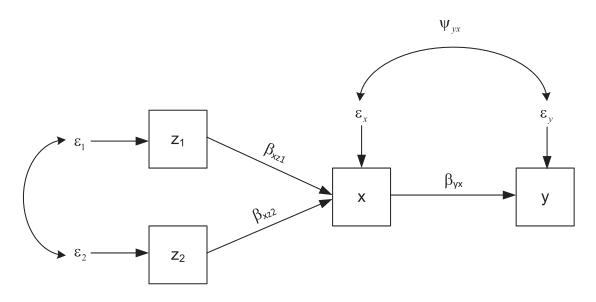
```


:::
::::::::::::::

# Quick demonstration in umx()

:::::::::::::: {.columns}
::: {.column width="50%"}

\tiny

```{r echo = T, warning = F, message = F}

library(umx)
df = umx_make_MR_data(nSubjects = 10000, Vqtl = .02, bXY= .1)

m1 = sem::tsls(formula = Y ~ X, instruments = ~ qtl, data = df)
coef(m1)

```


:::
::: {.column width="50%"}

\tiny

```{r echo = T, eval = F}


m1 = umxMR(Y~X, instruments= ~qtl, data = df)


```

|   |name         | Estimate|SE    |type            |
|:--|:------------|--------:|:-----|:---------------|
|7  |phi2         |    0.192|0.075 |Factor Cov      |
|3  |eY_to_Y      |    1.000|0     |Factor loading  |
|4  |eX_to_X      |    1.000|0     |Factor loading  |
|6  |eY_with_eY   |    0.913|0.032 |Factor Variance |
|8  |eX_with_eX   |    0.999|0.014 |Factor Variance |
|1  |X_to_Y       |    0.158|0.075 |Manifest path   |
|2  |qtl_to_X     |    0.181|0.014 |Manifest path   |
|9  |one_to_X     |   -0.196|0.017 |Mean            |
|10 |one_to_Y     |    0.002|0.01  |Mean            |
|11 |one_to_qtl   |    1.007|0.007 |Mean            |
|5  |qtl_with_qtl |    0.494|0.007 |Residual        |

:::
::::::::::::::

# Quick demonstration in umx()

:::::::::::::: {.columns}
::: {.column width="50%"}

\tiny

```{r echo = T, eval = F}

df = umx_make_MR_data(10e4)

m2 <- umxRAM("myMR", data = df, autoRun = FALSE,
	umxPath(v.m. = c("qtl", "X", "Y")),
	umxPath("qtl", to = "X"),
	umxPath("X", to = "Y")
	# umxPath("X", with = "Y") # Due to OpenMx rules, will be deleted!
)
m2 <- umxModify(m2, "X_with_Y", free = TRUE, value = .2)

```


:::
::: {.column width="50%"}

\tiny

```{r echo = T, eval = F}


m1 = umxMR(Y~X, instruments= ~qtl, data = df)


```

|   |name         | Estimate|SE    |type            |
|:--|:------------|--------:|:-----|:---------------|
|7  |phi2         |    0.192|0.075 |Factor Cov      |
|3  |eY_to_Y      |    1.000|0     |Factor loading  |
|4  |eX_to_X      |    1.000|0     |Factor loading  |
|6  |eY_with_eY   |    0.913|0.032 |Factor Variance |
|8  |eX_with_eX   |    0.999|0.014 |Factor Variance |
|1  |X_to_Y       |    0.158|0.075 |Manifest path   |
|2  |qtl_to_X     |    0.181|0.014 |Manifest path   |
|9  |one_to_X     |   -0.196|0.017 |Mean            |
|10 |one_to_Y     |    0.002|0.01  |Mean            |
|11 |one_to_qtl   |    1.007|0.007 |Mean            |
|5  |qtl_with_qtl |    0.494|0.007 |Residual        |

:::
::::::::::::::


# Genetic variant or polygenic score?

:::::::::::::: {.columns}
::: {.column width="50%"}

- The use of instrumental PS is common in Mendelian randomization studies [@burgessGuidelinesPerformingMendelian2020] . 
-  PS as an instrument is mathematically equivalent to a weighted mean of the results from individual SNPs  [@dudbridgePolygenicMendelianRandomization2021].

:::
::: {.column width="50%"}

```{r out.width="100%", warning = F, fig.align="center", fig.cap="DAG showing m single-nucleotide polymorphisms (SNPs) Gj used as instrumental variables for the association of exposure X with outcome Y in the presence of confounder U. Each SNP has an effect yj on X and a direct pleiotropic effect alphaj on Y. Under linear models for X and Y, the total effect of SNP j on Y is shown next"}
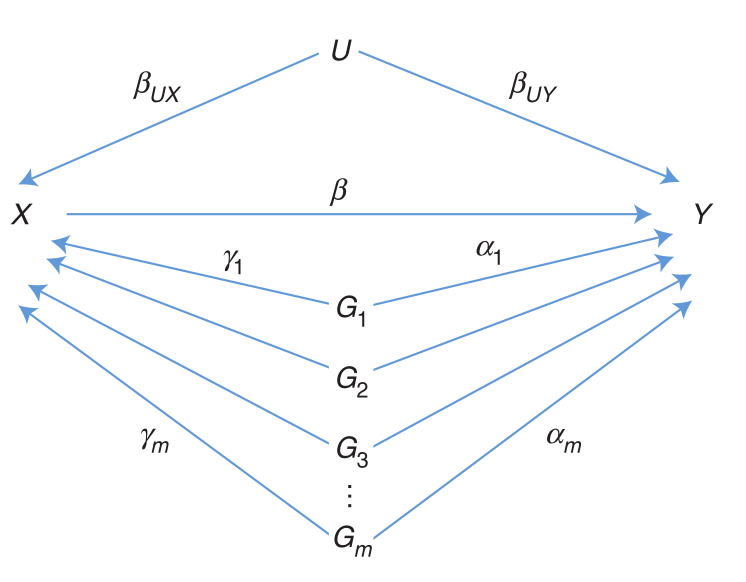
```

:::
::::::::::::::


# Classic Direction of Causation model - reciprocal causation 
:::::::::::::: {.columns}
::: {.column width="60%"}


# Model specification 

```{r, fig.align='center', out.width='80%'}
knitr::include_graphics("/home/luis/Documents/MR-Project/graphs/DoC_onyx.pdf")
```
[@heathTestingHypothesesDirection1993]

:::
::: {.column width="40%"}

## Path diagram representing a Bidirectional DoC for one twin.

\small
- causal paths are estimated affording information from the cross-twin cross-trait correlations. 
- Cross-twin covariance between additive genetic effects is 0.5 (not shown) for DZ twins, as DZs are expected to share 50% of the genetic effects.
- Standard SEM symbology is used. 


:::
::::::::::::::

# Classic Direction of Causation
:::::::::::::: {.columns}
::: {.column width="60%"}
 

# Model specification 


```{r, fig.align='center', out.width='100%'}
knitr::include_graphics("/home/luis/Documents/MR-Project/graphs/DoC_onyx.pdf")
```

:::
::: {.column width="40%"}

## Problems

\small

- Not identified as depicted
- Bias at the phenotypic level [@gillespieDirectionCausationModeling2003]
- Bias due to E confounding [@rasmussenMajorLimitationDirection2019]
- Better detection of cause with different variance component proportions for each phenotype [@maesUsingMultimodelInference2021]

:::
::::::::::::::

# MR-DoC model 

:::::::::::::: {.columns}
::: {.column width="60%"}
 
```{r out.width='100%', fig.align='center'}
knitr::include_graphics("/home/luis/Documents/MR-Project/graphs/MR-DOC.pdf")
```

:::
::: {.column width="40%"}

- Shown to recover exact values as a 2SLS-MR or 2sample-MR [@minicaExtendingCausalityTests2018]
- Not identified as shown

:::
::::::::::::::

# MR-DoC - identified cases


| x  | aX | cX | eX | aY | cY | eY | ra | rc | re | b1 | b2 | g1 | Id |
|----|----|----|----|----|----|----|----|----|----|----|----|----|-------------|
| fr | fr | fr | fr | fr | fr | fr | fr | fr | fr | fr | fr | fr | No         |
| **fr** | **fr** | **fr** | **fr** | **fr** | **fr** | **fr** | **fr** | **fr** | **0** | **fr** | **fr** | **fr** | **Yes**         |
| **fr** | **fr** | **fr** | **fr** | **fr** | **fr** | **fr** | **fr** | **fr** | **fr** | **fr** | **0** | **fr** | **Yes**         |
| **fr** | **fr** | **fr** | **fr** | **fr** | **fr** | **fr** | **fr** | **0**  | **fr** | **fr**  | **fr** |  **fr** | **Yes**         |
|   fr   |   fr   |   0   |   fr   |   fr   |   0   |    fr   |   fr     | 0     | fr | fr | fr  |   fr | No          |
| **fr** | **fr** | **fr** | **fr** | **fr** | **0** |  **fr** | **fr** | **0**  | **fr** | **fr**  | **fr** |  **fr** | **Yes**         |
| fr | fr | 0  | fr | fr | fr | fr | fr | 0  | fr | fr | fr | fr | No          |


# MR-DoC - identified cases

\tiny

| x  | aX | cX | eX | aY | cY | eY | ra | rc | re | b1 | b2 | g1 | Id |
|----|----|----|----|----|----|----|----|----|----|----|----|----|-------------|
| fr | fr | fr | fr | fr | fr | fr | fr | fr | fr | fr | fr | fr | No         |
| **fr** | **fr** | **fr** | **fr** | **fr** | **fr** | **fr** | **fr** | **fr** | **0** | **fr** | **fr** | **fr** | **Yes**         |
| fr | fr | fr | fr | fr | fr | fr | fr | fr | fr | fr | 0  | fr | Yes         |
| fr | fr | fr | fr | fr | fr | fr | fr | 0  | fr | fr | fr | fr | Yes         |
| fr | fr | 0  | fr | fr | 0  | fr | fr | 0  | fr | fr | fr | fr | No          |
| fr | fr | fr | fr | fr | 0  | fr | fr | 0  | fr | fr | fr | fr | Yes         |
| fr | fr | 0  | fr | fr | fr | fr | fr | 0  | fr | fr | fr | fr | No          |


```{r out.width='50%', fig.align='center'}
knitr::include_graphics("/home/luis/Documents/MR-Project/graphs/MR-DOC-re.pdf")
```

# MR-DoC - identified cases

\tiny

| x  | aX | cX | eX | aY | cY | eY | ra | rc | re | b1 | b2 | g1 | Id |
|----|----|----|----|----|----|----|----|----|----|----|----|----|-------------|
| fr | fr | fr | fr | fr | fr | fr | fr | fr | fr | fr | fr | fr | No         |
| fr | fr | fr | fr | fr | fr | fr | fr | fr | 0  | fr | fr | fr | Yes         |
| **fr** | **fr** | **fr** | **fr** | **fr** | **fr** | **fr** | **fr** | **fr** | **fr** | **fr** | **0** | **fr** | **Yes**         |
| fr | fr | fr | fr | fr | fr | fr | fr | 0  | fr | fr | fr | fr | Yes         |
| fr | fr | 0  | fr | fr | 0  | fr | fr | 0  | fr | fr | fr | fr | No          |
| fr | fr | fr | fr | fr | 0  | fr | fr | 0  | fr | fr | fr | fr | Yes         |
| fr | fr | 0  | fr | fr | fr | fr | fr | 0  | fr | fr | fr | fr | No          |


```{r out.width='50%', fig.align='center'}
knitr::include_graphics("/home/luis/Documents/MR-Project/graphs/MR-DOC-b2.pdf")
```

# MR-DoC - identified cases

\tiny

| x  | aX | cX | eX | aY | cY | eY | ra | rc | re | b1 | b2 | g1 | Id |
|----|----|----|----|----|----|----|----|----|----|----|----|----|-------------|
| fr | fr | fr | fr | fr | fr | fr | fr | fr | fr | fr | fr | fr | No         |
| fr | fr | fr | fr | fr | fr | fr | fr | fr | 0  | fr | fr | fr | Yes         |
| fr | fr | fr | fr | fr | fr | fr | fr | fr | fr | fr | 0  | fr | Yes         |
| **fr** | **fr** | **fr** | **fr** | **fr** | **fr** | **fr** | **fr** | **0**  | **fr** | **fr**  | **fr** |  **fr** | **Yes**         |
| fr | fr | 0  | fr | fr | 0  | fr | fr | 0  | fr | fr | fr | fr | No          |
| fr | fr | fr | fr | fr | 0  | fr | fr | 0  | fr | fr | fr | fr | Yes         |
| fr | fr | 0  | fr | fr | fr | fr | fr | 0  | fr | fr | fr | fr | No          |


```{r out.width='50%', fig.align='center'}
knitr::include_graphics("/home/luis/Documents/MR-Project/graphs/MR-DOC-rc.pdf")
```

# MR-DoC - identified cases

\tiny

| x  | aX | cX | eX | aY | cY | eY | ra | rc | re | b1 | b2 | g1 | Id |
|----|----|----|----|----|----|----|----|----|----|----|----|----|-------------|
| fr | fr | fr | fr | fr | fr | fr | fr | fr | fr | fr | fr | fr | No         |
| fr | fr | fr | fr | fr | fr | fr | fr | fr | 0  | fr | fr | fr | Yes         |
| fr | fr | fr | fr | fr | fr | fr | fr | fr | fr | fr | 0  | fr | Yes         |
| fr | fr | fr | fr | fr | fr | fr | fr | 0  | fr | fr | fr | fr | Yes         |
| fr | fr | 0  | fr | fr | 0  | fr | fr | 0  | fr | fr | fr | fr | No          |
| **fr** | **fr** | **fr** | **fr** | **fr** | **0** |  **fr** | **fr** | **0** | **fr** | **fr** | **fr** |  **fr** | **Yes**         |
| fr | fr | 0  | fr | fr | fr | fr | fr | 0  | fr | fr | fr | fr | No          |


```{r out.width='50%', fig.align='center'}
knitr::include_graphics("/home/luis/Documents/MR-Project/graphs/MR-DOC-rc-c2.pdf")
```


# MR-DoC 

```{r, fig.cap = "MR-DoC extension. Some confounding, not bidirectional. Not identified as depicted.", out.width="70%", warning = F}
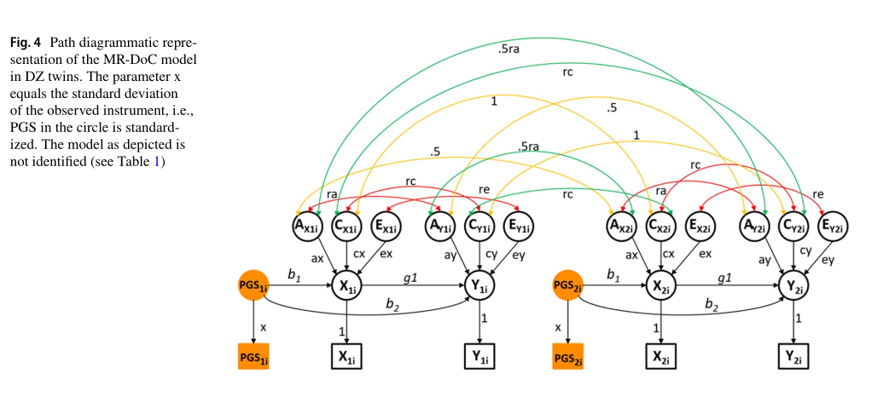
```
[@minicaExtendingCausalityTests2018]

#
\section{Bi-directional MR-DoC, MR-DoC2}

# MR-DoC2  [@dolanIntroducingPolygenicRisk2020]

:::::::::::::: {.columns}
::: {.column width="60%"}

# Model specification 

```{r, fig.align='center', out.width='80%'}
knitr::include_graphics("/home/luis/Documents/MR-Project/graphs/mrdoc.png")
```

:::
::: {.column width="40%"}

## Modified MR-DOC

\small

- Path diagram of the MR-DoC2 model for an individual. 
- The model includes the effects of additive genetic (A), common environment (C) and specific environment (E) factors for both X and Y, and their effects may correlate (parameters ra, rc and re). 

:::
::::::::::::::


# Results 

- Which  parameters drive power?

## Revisiting limitations

- Do we need phenotypes with distinct inheritance patterns
- What about measurement error at the phenotypic level?
- How robust it is regarding pleiotropy  
  
# Which  parameters drive power? [@vandersluisPowerCalculationsUsing2008]

:::::::::::::: {.columns}
::: {.column width="50%"}

\tiny

|          | g1 = 0 | g2 = 0 | g1 = g2 = 0 |
|----------|--------|--------|-------------|
| \color{orange}{g1}       | \color{orange}{0.517}  | \color{orange}{0.000}  | \color{orange}{0.289}       |
| \color{orange}{g2}       | \color{orange}{0.000}  | \color{orange}{0.517}  | \color{orange}{0.289}       |
| \color{teal}{b1}       | \color{teal}{0.365}  | \color{teal}{0.000}  | \color{teal}{0.181}       |
| \color{teal}{b3}       | \color{teal}{0.000}  | \color{teal}{0.365}  | \color{teal}{0.181}       |
| ra       | 0.000  | 0.000  | 0.000       |
| rc       | 0.000  | 0.000  | 0.000       |
| re       | 0.002  | 0.002  | 0.000       |
| rf       | 0.041  | 0.041  | 0.000       |
| ay       | 0.002  | 0.000  | 0.001       |
| ax       | 0.000  | 0.002  | 0.001       |
| cy       | 0.002  | 0.000  | 0.001       |
| cx       | 0.000  | 0.002  | 0.001       |
| Total R2 | 0.929  | 0.929  | 0.945       |
: Variance explained in statistical power (non-centrality parameter; NCP) by model parameters.

:::
::: {.column width="50%"}

\small
- Distinct inheritance patterns from phenotypes - not needed
- b1, b2, g1, and g2 are what drives power
- slightly better power without C variance

```{r, fig.align='center', out.width='85%'}
knitr::include_graphics("/home/luis/Documents/MR-Project/graphs/mrdoc-color.png")
```


:::
::::::::::::::


# Factorial design simulation - factors
:::::::::::::: {.columns}
::: {.column width="70%"}

```{r out.width="90%" }
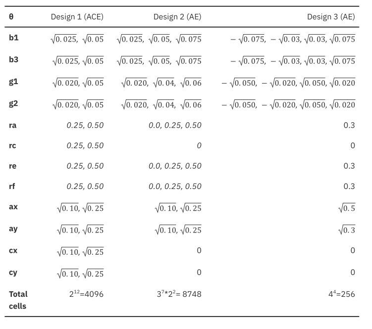
```
:::
:::::::::::::: {.column width="30%"}
Parameter levels on the three factorial designs, with respective total
number of cells for each design simulation. Also, ex was specified as
as 
$\sqrt{1-ax^2-cx^2}$
and ey as $\sqrt{1-ay^2-cy^2}$.
:::
::::::::::::::

# Power simulations [@vandersluisPowerCalculationsUsing2008]

\scriptsize

- Power simulations typically involve simulating many datasets corresponding to one true model and calculating the proportion of simulations where a given effect is significant. 

## Exact data simulation

1. choosing a set of parameter values for the model shown in the figure; 
2. exact data simulation, with arbitrary N=1,000 MZ pairs and N=1,000 DZ twin pairs; 
3. fitting the true model using ML estimation in OpenMx;
4. fitting the false model by fixing one or more parameters to zero and refitting the model; and
5. calculating the NCP and the power to reject the false model restrictions. 

- **Regressing the NCP on the parameters to work out which ones are important wrt power.**


# Revisiting limitations: Error at the phenotypic level

:::::::::::::: {.columns}
::: {.column width="70%"}


```{r out.width="90%" , fig.align="center"}
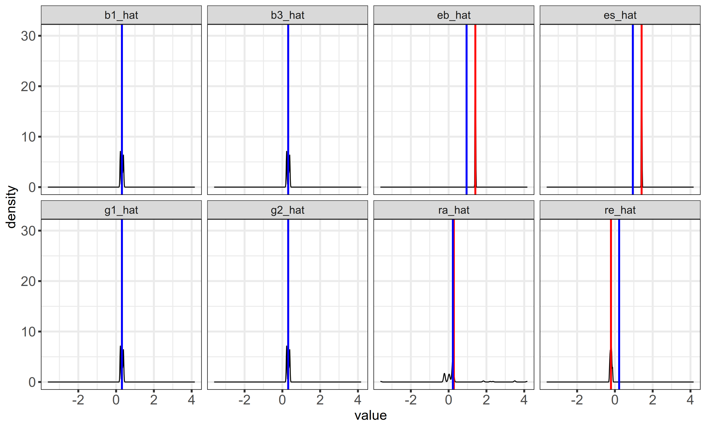
```

\tiny

$\theta$ = {b1 = c(sqrt(.05), sqrt(.1), sqrt(.15)), b3 =  c(sqrt(.05), sqrt(.1), sqrt(.15)), g1 = c(sqrt(.05), sqrt(.1), sqrt(.15)), g2 = c(sqrt(.05), sqrt(.1), sqrt(.15)), abs= .05,  ass = 0.05, cbs=0.05,  css=0.05,  ra=.224,  rc=.224,  re=.224, rf=.224, reliability =c(.0, .1, .2, .3, .4) 

:::
:::::::::::::: {.column width="30%"}

## Reliability 

\tiny

```
relB = var(B) / {var(B) + var(errorB)}
relS = var(S) / {var(S) + var(errorS)}
```

\small

- power reduces
- but no bias in estimation of b1, b3, g1, g2
:::
::::::::::::::

# Other types of  pleiotropy not included in the model

```{r out.width="80%" , fig.align="center"}
knitr::include_graphics("/home/luis/Documents/MR-Project/graphs/mrdocfull.png")
```


# Not robust to pleiotropy (b2 and b4 !=0)

:::::::::::::: {.columns}
::: {.column width="70%"}
```{r pleiotropy, out.width="90%"}
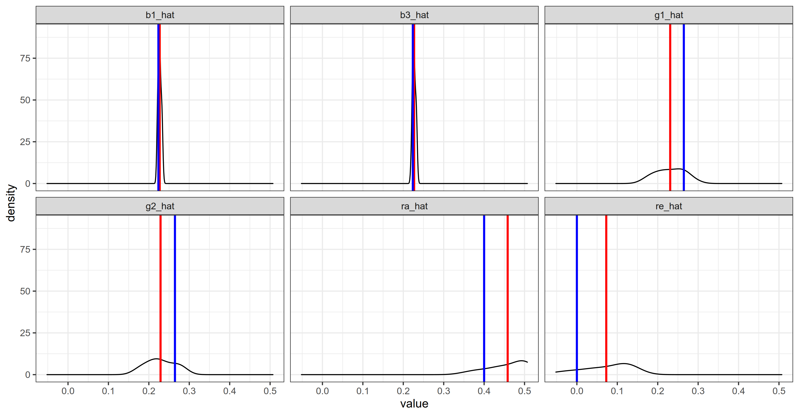
```
:::
:::::::::::::: {.column width="30%"}

\tiny

The red lines indicate the observed mean of the distribution of the estimated v while the 
blue lines indicated the simulated value for the parameter. If the  red line is on the right of the 
 blue line, then the parameter is overestimated and if the  red line is on the left of the 
blue line the parameter is underestimated.

\vspace{3mm}

Results from simulation with 1024 replications, with variation on the factor level of b2 and b4 (0, $\sqrt{.001}$, $\sqrt{.002}$, $\sqrt{.003}$, $\sqrt{.004}$). 
:::
::::::::::::::

# Reasonable sample sizes in relevant scenarios 


:::::::::::::: {.columns}
::: {.column width="60%"}

```{r onlyx, out.width="90%"}
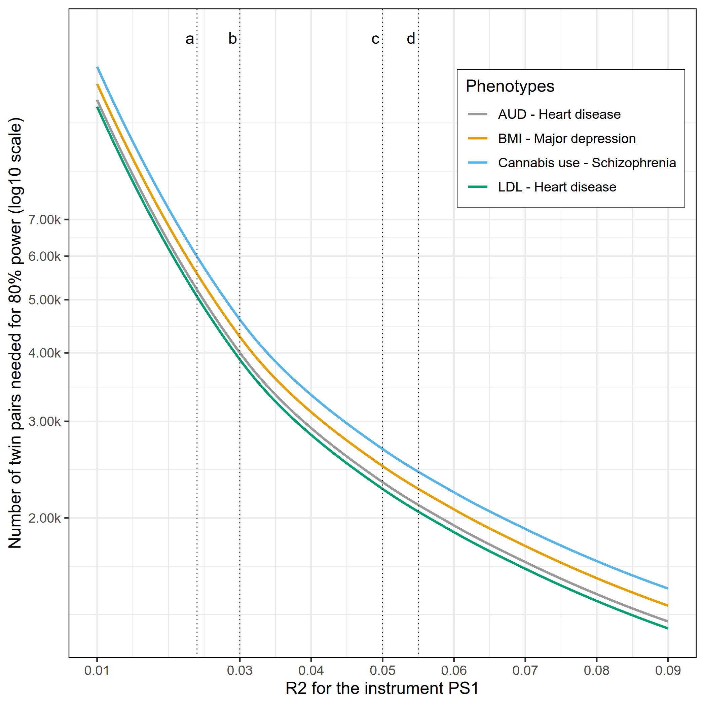
```

:::
::: {.column width="40%"}

\tiny

A and C variances for the groups: 

1. alcohol use (a^2^ 49%, c^2^ 10%) (Verhulst et al., 2015)  and heart disease (a^2^ 22%, c^2^ 0%)  (Wu et al., 2014); 
2. BMI (a^2^ 72%, c^2^ 3%)  (Rokholm et al., 2011)  and major depression
(a^2^ 37%, c^2^ 1%) (Scherrer et al., 2003); 
3. cannabis use (a^2^ 51%, c^2^ 20%) (Verweij et al., 2010) and
schizophrenia (a^2^ 81%, c^2^ 11%) (Sullivan et al., 2003); 
4. dyslipidemia (LDL) (a^2^ 60%, c^2^ 28%) (Zhang et al., 2010)
and heart disease  (a2 22%, c^2^ 0%) (Wu et al., 2014). 


:::
::::::::::::::


# Reasonable sample sizes in relevant scenarios 


:::::::::::::: {.columns}
::: {.column width="60%"}

```{r , out.width="90%"}

```

:::
::: {.column width="40%"}

\tiny

A and C variances for the groups: 

1. alcohol use (a^2^ 49%, c^2^ 10%) (Verhulst et al., 2015)  and heart disease (a^2^ 22%, c^2^ 0%)  (Wu et al., 2014); 
2. BMI (a^2^ 72%, c^2^ 3%)  (Rokholm et al., 2011)  and major depression
(a^2^ 37%, c^2^ 1%) (Scherrer et al., 2003); 
3. cannabis use (a^2^ 51%, c^2^ 20%) (Verweij et al., 2010) and
schizophrenia (a^2^ 81%, c^2^ 11%) (Sullivan et al., 2003); 
4. dyslipidemia (LDL) (a^2^ 60%, c^2^ 28%) (Zhang et al., 2010)
and heart disease  (a2 22%, c^2^ 0%) (Wu et al., 2014). 

- Vertical lines were added to represent R2 for four PSs reported in recent papers: a, smoking (Pasman et al., 2022); b, BMI (Furlong and Klimentidis, 2020); c, LDL (Kuchenbaecker et al., 2019); d,  attention deficit hyperactivity disorder (ADHD) (Demontis et al., 2019).

:::
::::::::::::::


# BeGe [@castro-de-araujoMRDoC2BidirectionalCausal2022a] 
:::::::::::::: {.columns}
::: {.column width="70%"}

```{r out.width="90%"}
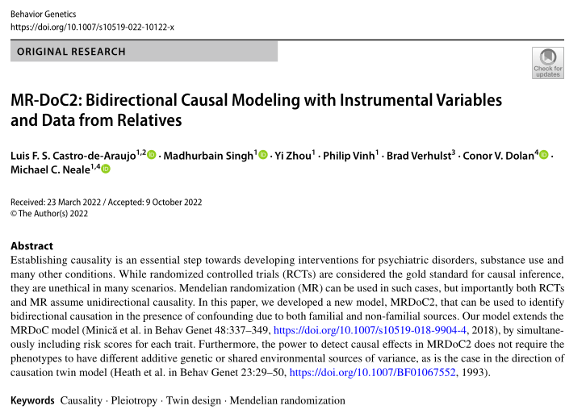
```
:::
::: {.column width="30%"}


```{r qr-paper, out.width='80%', fig.align='center'}
image(qrencode_raster("https://link.springer.com/article/10.1007/s10519-022-10122-x"),
  asp = 1, col = c("white", "black"), axes = FALSE,
  xlab = "", ylab = ""
)
```
<!-- ../graphs/qr-twitter-1.pdf -->

:::
::::::::::::::


# Conclusion

## Tour on MR

- Requires fulfilling of strong assumptions
- Pleiotropy being the hardest one to fulfill

## MR-DoC2
- Can complement MR within twin studies framework with a bidirectional causal model
- Improves on some limitations of classic DoC and MR

## Future directions
- Apply MR-DoC2 to real data

# Acknowledgements

:::::::::::::: {.columns}
::: {.column width="50%"}

## Team

- Madhur Singh. 
- Daniel Zhou. 
- Philip Vinh. 
- Brad Verhulst.

\vspace{3mm}
- Hermine Maes
- Conor V Dolan.  
- Michael C Neale.  

- NIH grant no R01 DA049867 and 5T32MH-020030 


:::
::: {.column width="50%"}


## Contact 

```{r qr-twitter, out.width='80%', fig.align='center'}
image(qrencode_raster("https://twitter.com/lf_araujo"),
  asp = 1, col = c("white", "black"), axes = FALSE,
  xlab = "", ylab = ""
)
```
<!-- ../graphs/qr-twitter-1.pdf -->

:::
::::::::::::::

\appendix

#  {.standout}


- Thank you

# Genetic variant or polygenic score?

:::::::::::::: {.columns}
::: {.column width="50%"}


\tiny
- the total effect of SNP j on Y: $\Gamma_j=\alpha_j+\beta \gamma_j$

- PS  which is the weighted sum of genotypes over many SNPs:

$$
S=\sum_{j=1}^m \gamma_j G_j
$$

- where G_j is a numerical coding of the genotype
of SNP_j, typically the number of effect alleles carried

- The ratio estimate for the polygenic score
  S is:

:::
::: {.column width="50%"}

\tiny

$$
\begin{gathered}
\frac{\operatorname{cov}(S, Y)}{\operatorname{cov}(S, X)}=\frac{\sum \gamma_j \operatorname{cov}\left(G_j, Y\right)}{\sum \gamma_j \operatorname{cov}\left(G_j, X\right)} \\
=\frac{\sum \gamma_j \Gamma_j \operatorname{var}\left(G_j\right)}{\sum \gamma_j \Gamma_j \operatorname{var}\left(G_j\right)} \\
=\sum_j \frac{\gamma_j^2 \operatorname{var}\left(G_j\right)}{\sum_k \gamma_k^2 \operatorname{var}\left(G_k\right)} \frac{\Gamma_j}{\gamma_j} .
\end{gathered}
$$


- polygenic score approach is in fact equivalent to an average MR ratio approach

- or,   PS as an instrument is mathematically equivalent to a weighted mean of the results from individual SNPs  [@dudbridgePolygenicMendelianRandomization2021].

:::
::::::::::::::


