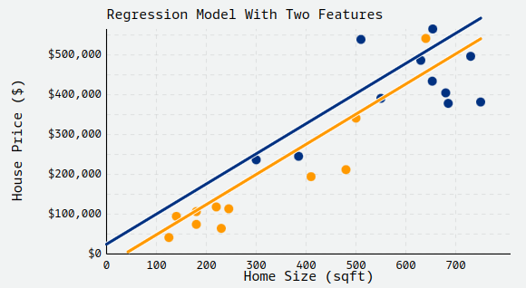
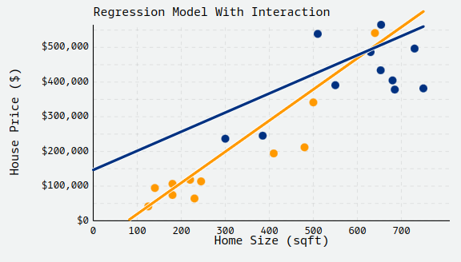

```{r setup, include=FALSE}

c("ProjectTemplate", "here", "TwoSampleMR", "stringr", "ggplot2",
  "dplyr", "qrencoder", "knitr", "ggeffects", "interactions",
  "margins") |>
  lapply(function(x) {
    if (!require(x, character.only = TRUE)) {
      install.packages(x, dependencies = TRUE)
      library(x)}})

set.seed(42) # setting seed for stochastic functions
setwd(here()) # needed as we are in /src, in linux here() should be used

load.project() # Loading the project
pclean()

# R options
options(
  digits = 3, # Only two decimal digits
  scipen = 999 # Remove scientific notation
)


# Knitr options
knitr::opts_chunk$set(
  comment = NA, # remove comment symbol
  cache.path = "../cache/", # where should I save cache?
  fig.path = "../graphs/", # where should I save figures?
  echo = F, # dont echo by default
  cache = F, # dont cache by default
  fig.width = 10, # setting the best witdth for figures
  fig.height = 7, # best height
  dpi = 300, # high dpi for publication quality,
  error = FALSE # do not interrupt in case of errors
)

cb_palette <- c("#999999", "#E69F00", "#56B4E9", "#009E73",
                "#F0E442", "#0072B2", "#D55E00", "#CC79A7")

theme_luis  <- function() {
  return_theme <-  ggplot2::theme_bw(12) +
    ggplot2::theme( 
        panel.border = element_rect(colour = "black"),
        legend.background = element_rect(linetype = 1, size = 0.2, colour = 1),
        text = element_text(size = 13),
        axis.text = element_text(size = 12),
        element_line(size = 1))
}

```

\section{Multiple regression recap}


# Multiple Linear Regression

-  Extension of the simple linear regression model to two or more independent variables


$$y = \beta_0 + \beta_1x_1 + \beta_2x_2 + \dots + \beta_px_p + \epsilon$$

-  Cognitive performance = Baseline + Depression + Age + Sex + Error

- Partial Regression Coefficients: effect on the  dependent variable when increasing the *i*^th^ independent variable by 1 unit, **holding all other predictors constant**

# Categorical Independent Variables

-  Qualitative variables are easily incorporated in regression  framework through ***dummy variables***

- Simple example: sex can be coded as 0/1

- What if my categorical variable contains three levels:

\[
\begin{aligned}
& \mathrm{x}_{1}=\left\{\begin{array}{l}0 \text { if } \mathrm{AA} 
                  \\1 \text { if } \mathrm{AG} 
                  \\2 \text { if } \mathrm{GG}\end{array}\right. 
\end{aligned}
\]

# Categorical Independent Variables


:::::::::::::: {.columns}
::: {.column width="50%"}

-  Previous coding would result in ***colinearity***

-  Solution is to set up a series of dummy variable. 

- for k levels you need k-1 dummy variables

\[
\begin{aligned}
& \mathrm{x}_{1}=\left\{\begin{array}{l}1 \text { if } \mathrm{AA} \\0 \text { otherwise }\end{array}\right. \\
& x_{2}=\left\{\begin{array}{l}1 \text { if } A G \\0 \text { otherwise }\end{array}\right.
\end{aligned}
\]

:::
::: {.column width="50%"}


|  |  x1 |  x2 |
|:--:|:--:|:--:|
|  AA |  1 |  0 |
|  AG |  0 |  1 |
|  GG |  0 |  0 |


:::
::::::::::::::


# Assumptions

Validity
: Does the data we're modeling matches the problem we're actually trying to solve?

Representativeness
: Is the sample data used in the regression model representative of the population to which it will be applied?

Linearity
: The deterministic component of a regression model is a linear function of the separate predictors: $y=B_0 + B_1x_1 + ... + B_px_p$


Independence of Errors
: The errors from our model are independent.

Homoscedasticity
: The errors from our model have equal variance.

Normality of Errors
: The errors from our model are normally distributed.


# Multivariate regression

:::::::::::::: {.columns}
::: {.column width="50%"}

```{r out.width = "100%", fig.align = "center"}

```

\tiny 

$$house price=-27154+757*sqft+51867*pool$$

- In our example, we model home prices as a function of both the size of the house (sqft) and whether or not it has a pool

:::
::: {.column width="50%"}

\tiny

- intercept: -$27,154,  the predicted average housing price for houses with all x~i~ = 0. Or the cost of houses with no pools and a square-footage of zero.

- coefficient of pool: $51,867, average expected price difference in houses of the same size (in sqft) if they do or do not have a pool. In other words, we expect, on average, houses of the same size to cost $51,867 more if they have a pool than if they do not.

- coefficient of sqft: $757,  average expected price difference in housing price for houses that have the same value of pool but differ in size by one square-foot.

- We assume the same slope for sqft.Hence, two lines. This isn't always a valid assumption to make.
:::
::::::::::::::

# Back to our housing example, now with interactions 


:::::::::::::: {.columns}
::: {.column width="50%"}

```{r out.width = "100%", fig.align = "center"}

```

\tiny

$$house price=-70296+899*sqft+217111*pool-347*(sqft:pool)$$

- If we believe that the slope for sqft should differ between houses that do have pools and houses that do not, we can add an interaction term to our model, (sqft:pool).

:::
::: {.column width="50%"}

\tiny

- interaction term: -$347, represents the difference in the slope for sqft, comparing houses that do and do not have pools. Visually, this represents the difference between the slopes of the two lines.

- intercept: -$70,296, represents the predicted housing price for houses with no pools and a square-footage of zero.

- coefficient of pool: $217,111, represents the average expected difference in houses of the same size (0 sqft) that differed in whether or not they had a pool. (It's not super useful since we don't have houses with 0 square-feet).

- coefficient of sqft: $899, represents the average expected difference in housing price for houses that do not have a pool (pool= 0) but differ in size by one square-foot.
:::
::::::::::::::


#


\section{Interaction terms}


# What is an Interaction?

- An interaction is a predictor that is
some combination of the other
predictors.

# Constructing an interaction


- Interactions are often the product of two or
more predictors.
-  Can be written as,

$$Y = \beta_0 + \beta_1X_1 + \beta_2X_2 + \beta_3X_1X_2 + \epsilon$$

# Conditional vs. marginal effects

- Conditional effects: the effect of a predictor on the response, holding all other predictors constant.

- Marginal effects: the effect of a predictor on the response, averaged over all values of the other predictors.


# Conditional vs. marginal effects

- If the conditional effects of X1 on Y at
different levels of X2 are all the same then
there is no interaction.

# Interpreting interaction effects

\small

|Parameter | Meaning | Where people (used to) go awry |
|:----|----------------|--------------------------------|
| $\beta_0$ | Expected value of the DV when X1 and X2 ==0 | People get this  |
| $\beta_1$ | Effect of X1 when X2 == 0 | Not marginal effects!  |
| $\beta_2$ | Effect of X2 when X1 == 0 | Not marginal effects!  |
| $\beta_3$ | The addition to the conditional effect when both X! and X2 are 1 | People just look at the significance of the interaction parameter and do not calculate the underlying marginal or conditional effects or standard errors |

# In the past it was common to see standard errors wrongly calculated

- A common mistake that people make when
interpreting interaction models is using the
wrong standard errors.
- The standard errors that are printed in every
regression table are the positive square roots of
the diagonal elements of the variance-
covariance matrix of $\beta$
- This does not matter anymore because of `margins()`


# Interaction and dummmy variable, Iris flower data set

:::::::::::::: {.columns}
::: {.column width="50%"}

$$\widehat{petal.length}_i = \beta_0 + \beta_1 sepal.length_i  $$


:::
::: {.column width="50%"}


```{r}
data(iris)


iris$pred <- predict(lm(Petal.Length ~ Sepal.Length, data = iris))

# plot in ggplot
ggplot(iris, aes(x = Sepal.Length, y = Petal.Length, color = Species)) +
  geom_point() + 
  geom_line(aes(Sepal.Length, pred )) +
  theme_luis() + 
  theme( legend.position = c(0.9, 0.15))


```

:::
::::::::::::::

# Let's improve the model?

## Creating the dummy

$$\begin{aligned} \text { setosa }_i &=\left\{\begin{array}{l}1 \text { if species of flower } \mathrm{i}=\text { setosa }, \forall i \in[1,150] \\ 0 \text { otherwise }\end{array}\right.\\ \text { versicolor }_i &=\left\{\begin{array}{l}1 \text { if species of flower } \mathrm{i}=\text { versicolor, } \forall i \in[1,150] \\ 0 \text { otherwise }\end{array}\right.\end{aligned}$$


## Our formula is then


$$\widehat{petal.length}_i = \beta_0 + \beta_1 sepal.length_i + \beta_2 \text { setosa }_i + \beta_3 \text { versicolor }_i$$


# By substitution we get three lines with same slope
\tiny
## If it is setosa

$$
\begin{aligned}
\widehat{petal.length}_i &= \beta_0 + \beta_1 sepal.length_i + \beta_2 \text { setosa }_i + \beta_3 \text { versicolor }_i \\
&= \beta_0 + \beta_1 sepal.length_i + \beta_2 1 + \beta_3 0 \\
&= \beta_0 + \beta_1 sepal.length_i + \beta_2 \\
&= (\beta_0 + \beta_2) + \beta_1 sepal.length_i
\end{aligned}
$$

## If it is versicolor

$$
\begin{aligned}
\widehat{petal.length}_i &= \beta_0 + \beta_1 sepal.length_i + \beta_2 \text { setosa }_i + \beta_3 \text { versicolor }_i \\
&= \beta_0 + \beta_1 sepal.length_i + \beta_2 0 + \beta_3 1 \\
&= \beta_0 + \beta_1 sepal.length_i + \beta_3 \\
&= (\beta_0 + \beta_3) + \beta_1 sepal.length_i
\end{aligned}
$$

## If it is virginica

$$
\begin{aligned}
\widehat{petal.length}_i &= \beta_0 + \beta_1 sepal.length_i + \beta_2 \text { setosa }_i + \beta_3 \text { versicolor }_i \\
&= \beta_0 + \beta_1 sepal.length_i + \beta_2 0 + \beta_3 0 \\
&= \beta_0 + \beta_1 sepal.length_i \\
&= \beta_0 + \beta_1 sepal.length_i
\end{aligned}
$$

# Same slope, different intercepts

:::::::::::::: {.columns}
::: {.column width="50%"}


\tiny

```{r eval = F, echo = T, out.width = "80%"}

iris$pred <- predict(lm(Petal.Length ~ Sepal.Length+Species, 
                        data = iris))

# plot in ggplot
ggplot(iris, aes(x = Sepal.Length, y = Petal.Length, color = Species)) +
  geom_point() + 
  geom_line(aes(Sepal.Length, pred )) +
  theme_luis() +
  theme( legend.position = c(0.9, 0.15))

```

:::
::: {.column width="50%"}


```{r out.width = "100%"}

iris$pred <- predict(lm(Petal.Length ~ Sepal.Length+Species, data = iris))

# plot in ggplot
ggplot(iris, aes(x = Sepal.Length, y = Petal.Length, color = Species)) +
  geom_point() + 
  geom_line(aes(Sepal.Length, pred )) +
  theme_luis() +
  theme( legend.position = c(0.9, 0.15))

```

:::
::::::::::::::


# Now we can add an interaction


\tiny

$$
\begin{aligned}
&\widehat{petal.length}_i = \beta_0 + \beta_1 sepal.length_i + \beta_2 \text { setosa }_i + \beta_3 \text { versicolor }_i \\
&+ \beta_4 sepal.length_i \text { setosa }_i + \beta_5 sepal.length_i \text { versicolor }_i
\end{aligned}
$$

- this will result in three unique lines depending on the species of the flower. 
- both the intercepts and the slopes will be allowed to be different.


## Does it make sense to retain the interaction?


\tiny

```{r out.width = "80%", echo = T}
inter <- lm(Petal.Length ~ Sepal.Length + Species + Sepal.Length:Species, data = iris)

```

# Does it make sense to retain the interaction?


\tiny

```{r}
nospecies <- lm(Petal.Length ~ Sepal.Length, data = iris)
w_species <- lm(Petal.Length ~ Sepal.Length + Species, data = iris)
```

```{r echo = T, warning = F, message = F}
broom::tidy(inter) |> kable()
anova(nospecies, w_species, inter)
```


# Now we can add an interaction

:::::::::::::: {.columns}
::: {.column width="50%"}

\tiny

$$
\begin{aligned}
&\widehat{petal.length}_i = \beta_0 + \beta_1 sepal.length_i + \beta_2 \text { setosa }_i + \beta_3 \text { versicolor }_i \\
&+ \beta_4 sepal.length_i \text { setosa }_i + \beta_5 sepal.length_i \text { versicolor }_i
\end{aligned}
$$

- this will result in three unique lines depending on the species of the flower. 
- both the intercepts and the slopes will be allowed to be different.
- ggplot geom_smooth does this by default if `color` is used

:::
::: {.column width="50%"}


```{r warning = F, message = F}

ggplot(iris, aes(x = Sepal.Length, y = Petal.Length, color = Species)) +
  geom_point() + 
  geom_smooth(method = "lm", se = FALSE) +
  theme_luis()+
  theme( legend.position = c(0.9, 0.15))


```

:::
::::::::::::::

# Now we can add an interaction

:::::::::::::: {.columns}
::: {.column width="50%"}

\tiny

```{r echo = T, eval = F}

ggplot(iris, aes(x = Sepal.Length, y = Petal.Length, color = Species)) +
  geom_point() + 
  geom_smooth(method = "lm", se = FALSE) +
  theme_luis()+
  theme( legend.position = c(0.9, 0.15))


```

:::
::: {.column width="50%"}


```{r warning = F, message = F}

ggplot(iris, aes(x = Sepal.Length, y = Petal.Length, color = Species)) +
  geom_point() + 
  geom_smooth(method = "lm", se = FALSE) +
  theme_luis()+
  theme( legend.position = c(0.9, 0.15))


```

:::
::::::::::::::


# 

\section{Visualizing interactions}


# Mtcars data set - regression of speed on wt*cyl 

:::::::::::::: {.columns}
::: {.column width="50%"}

\tiny

```{r echo=T, eval=F}

fit1 <- glm(qsec ~ wt*as.factor(cyl), data = mtcars)
broom::tidy(fit1) |> kable()


```

- Note: not significant, but we will return to this later `summary(margins(fit1))`

:::
::: {.column width="50%"}

\tiny

```{r}

fit1 <- glm(qsec ~ wt*as.factor(cyl), data = mtcars)
broom::tidy(fit1) |> kable()


```


:::
::::::::::::::

# Regression of mpg on wt*cyl

:::::::::::::: {.columns}
::: {.column width="50%"}

\tiny

```{r echo=T, eval=F}

fit <- glm(mpg ~ wt*as.factor(cyl), data = mtcars)
broom::tidy(fit) |> kable()

```

:::
::: {.column width="50%"}

\tiny

```{r}

fit <- glm(mpg ~ wt*as.factor(cyl), data = mtcars)
broom::tidy(fit) |> kable()

```

:::
::::::::::::::

# Regression of mpg on wt*cyl

:::::::::::::: {.columns}
::: {.column width="50%"}

\tiny

```{r echo=T, eval=F}

pred <- ggpredict(fit, terms = c("wt", "cyl"))
plot(pred, add.data = TRUE)+
  theme_luis()+
  theme( legend.position = c(0.1, 0.15))

```

:::
::: {.column width="50%"}


```{r }

pred <- ggpredict(fit, terms = c("wt", "cyl"))

plot(pred, add.data = TRUE) + 
  theme_luis() +
  theme( legend.position = c(0.9, 0.85))

```
:::
::::::::::::::


# An interaction may not be sig across the entire range of the predictor

:::::::::::::: {.columns}
::: {.column width="50%"}

## Let's see  mpg ~ hp + wt

\tiny

```{r echo=T}
fit <- glm(mpg ~ hp*wt, data = mtcars)
pred <- ggpredict(fit, terms = c("hp", "wt"))

# plot(pred, add.data = TRUE) +
#   theme_luis() +
#   theme( legend.position = c(0.9, 0.85))

broom::tidy(fit) |> kable()
```

:::
::: {.column width="50%"}

```{r}

plot(pred, add.data = TRUE) +
  theme_luis() +
  theme( legend.position = c(0.9, 0.85))


```

:::
::::::::::::::

# Now, from what point the slope becomes non signficant?

:::::::::::::: {.columns}
::: {.column width="50%"}

## JOHNSON-NEYMAN INTERVAL

\tiny

```{r echo=T, eval=F}

jn <- johnson_neyman(fit, wt, hp , plot = TRUE)
jn 

```


:::
::: {.column width="50%"}


```{r results='hide'}

jn <- johnson_neyman(fit, wt, hp , plot = TRUE)
jn 
```

:::
::::::::::::::


# Now, from what point the slope becomes non signficant?

:::::::::::::: {.columns}
::: {.column width="50%"}

## JOHNSON-NEYMAN INTERVAL - Overlayed on data 

\tiny

```{r echo=T, eval=F}

fit <- glm(mpg ~ hp*wt, data = mtcars)
pred <- ggpredict(fit, terms = c("hp", "wt"))
jn <- johnson_neyman(fit, wt, hp , plot = TRUE)
jn_bound <- as.numeric(jn$bounds[1])

plot(pred, add.data=T) + 
  geom_vline(xintercept = jn_bound, linetype = "dashed", 
             color = "red")+
  theme_luis() +
  theme( legend.position = c(0.9, 0.85))

```


:::
::: {.column width="50%"}


```{r}

fit2 <- glm(mpg ~ hp*wt, data = mtcars)
pred <- ggpredict(fit2, terms = c("hp", "wt"))
jn<-johnson_neyman(fit2, wt, hp , plot = TRUE)
jn_bound<-as.numeric(jn$bounds[1])

plot(pred, add.data=T) + 
  geom_vline(xintercept = jn_bound, linetype = "dashed", color = "red")+
  theme_luis() +
  theme( legend.position = c(0.9, 0.85))


```

:::
::::::::::::::

# Three-way interactions

:::::::::::::: {.columns}
::: {.column width="50%"}

\tiny

```{r echo=T, eval=T}

fit <- glm(mpg ~ hp*wt*as.factor(cyl), data = mtcars)
```

```{r echo=T, eval=F}
dat <- ggpredict(fit, terms = c("hp", "wt", "cyl"))
plot(dat, ci = FALSE)+
  theme( legend.position = c(0.9, 0.85))
 
```


:::
::: {.column width="50%"}

```{r fig.align='center'}

fit <- glm(mpg ~ hp*wt*as.factor(cyl), data = mtcars)
dat <- ggpredict(fit, terms = c("hp", "wt", "cyl"))
    
plot(dat, ci = FALSE)+
  theme_luis()+
  theme( legend.position = c(0.9, 0.40))
 
```

:::
::::::::::::::


# The summary

\tiny

```{r echo=T}
broom::tidy(fit) |> kable()
```

# 

\section{Marginal effects}


# Marginal effects

- Marginal effects: the effect of a predictor on the response, averaged over all values of the other predictors.
- also, the instantaneous effect of “x” on “y”. Calculated with a derivative of x in respect to y, expressed mathematically as  $dy/dx$ [@fordBeginners2022]. 
  - the “instantaneous rate of change" of y with respect to x.  

# What are the marginal effects for `mpg ~ hp*wt` 


```{r echo=T, eval=T}
fit_m <- margins(fit2)
summary(fit_m)
```

- Interpretation:  for each unit increase of mpg an average reduction of `hp` 3% is expected.

# Plotting the marginal effects 

:::::::::::::: {.columns}
::: {.column width="50%"}

\tiny

```{r echo=T, eval=F}

fit_mo <- as_tibble(summary(fit_m))
p <- ggplot(data = fit_mo, aes(x = reorder(factor, AME),
                              y = AME, ymin = lower, ymax = upper))

p + geom_hline(yintercept = 0, color = "gray80") +
    geom_pointrange(size = 1) + coord_flip() +
    labs(x = NULL, y = "Average Marginal Effect") + 
  geom_hline(yintercept = 0, color = "red") +
    theme_luis()

```


:::
::: {.column width="50%"}

```{r echo=F, eval=T}
fit_mo <- as_tibble(summary(fit_m))
p <- ggplot(data = fit_mo, aes(x = reorder(factor, AME),
                              y = AME, ymin = lower, ymax = upper))

p + geom_hline(yintercept = 0, color = "gray80") +
    geom_pointrange(size = 1) + coord_flip() +
    labs(x = NULL, y = "Average Marginal Effect") + 
  geom_hline(yintercept = 0, color = "red") +
    theme_luis()
```

:::
::::::::::::::


# Can we plot the conditional effects too?

:::::::::::::: {.columns}
::: {.column width="50%"}

\tiny

```{r echo=T, eval=F}

glm(mpg ~ hp*wt*as.factor(cyl), data = mtcars) %>%
  cplot(x = "cyl", draw = F) %>%
  ggplot( aes(x = reorder(xvals, yvals),
                      y = yvals, ymin = lower, ymax = upper))+
                      geom_pointrange(size = 1 ) + coord_flip() +
    labs(x = "Number of cylinders", y = "Conditional Effect") +
    theme_luis()

```


:::
::: {.column width="50%"}


```{r}

glm(mpg ~ hp*wt*as.factor(cyl), data = mtcars) %>%
  cplot(x = "cyl", draw = F) %>%
  ggplot( aes(x = reorder(xvals, yvals),
                      y = yvals, ymin = lower, ymax = upper))+
                      geom_pointrange(size = 1 ) + coord_flip() +
    labs(x = "Number of cylinders", y = "Conditional Effect") +
    theme_luis()

```

:::
::::::::::::::

# Oddities of interactions in linear regressions

- At the beginning I said, keep the interaction that is significant, but [@bruinDecipheringInteractionsLogistic; @vanhoveInteractionsLogisticRegression2019]
  - In the transformation from log-odds to probabilities (AME) the interaction may not be significant anymore [vanhoveInteractionsLogisticRegression2019], or worse
  - The interaction may be significant in the AME, but not in conditional effects


# Example when the conditional is not significant while the AME is


:::::::::::::: {.columns}
::: {.column width="50%"}

## speed on wt*cyl

\tiny

```{r echo=T, eval=T}
fit1 <- glm(qsec ~ wt*as.factor(cyl), data = mtcars)
broom::tidy(fit1) |> kable()
```

:::
::: {.column width="50%"}

\tiny

```{r echo = T}
summary(margins(fit1)) |> kable()
```


:::
::::::::::::::


# In OpenMX, maximum likelihood

:::::::::::::: {.columns}
::: {.column width="40%"}


\tiny 

```{r echo=T, eval  = F}

library(umx)

model <- "
  mpg ~ hp_on_mpg*hp + wt_on_mpg*wt 
  moderation := hp_on_mpg*wt_on_mpg
"

m1 <- umxRAM(model, data = mtcars)
m1 <- umxCI(m1)
umxSummary(m1, std = T)

```

:::
::: {.column width="60%"}

\tiny

Table: Parameter loadings for model 'm1'

|   |name         | Std.Estimate|Std.SE |CI                   |type          |
|:--|:------------|------------:|:------|:--------------------|:-------------|
|5  |hp_with_wt   |         0.66|0.1    |0.66 [0.46, 0.85]    |Manifest Cov  |
|1  |hp_on_mpg    |        -0.36|0.1    |-0.36 [-0.56, -0.17] |Manifest path |
|2  |wt_on_mpg    |        -0.63|0.09   |-0.63 [-0.81, -0.45] |Manifest path |
|7  |one_to_mpg   |         6.28|0.7    |6.28 [4.91, 7.64]    |Mean          |
|8  |one_to_hp    |         2.17|0.32   |2.17 [1.54, 2.81]    |Mean          |
|9  |one_to_wt    |         3.34|0.45   |3.34 [2.45, 4.23]    |Mean          |
|3  |mpg_with_mpg |         0.17|0.06   |0.17 [0.06, 0.28]    |Residual      |
|4  |hp_with_hp   |         1.00|0      |1 [1, 1]             |Residual      |
|6  |wt_with_wt   |         1.00|0      |1 [1, 1]             |Residual      |

Model Fit: Chi2(0) = 0, p = 1.000; CFI = 1; TLI = 1; RMSEA = 0
Algebra'moderation' = 0.123CI95[0.074, 0.173]. p-value < 0.001

:::
::::::::::::::


# Conclusion

- We started reviewing multiple regression
- Then discussed the syntax and interpretation of parameters when an interaction term is included
- Finally, we discussed how to extract the marginal effects of the interaction term
- Luckly the package `margins()` makes this simple.


# Acknowledgements


:::::::::::::: {.columns}
::: {.column width="50%"}

## Team

- Charles Gardner (2015) 
- Brad Verhulst (2013)
- Joshua Pritkin. 
- Rob Kirkpatrick. 

\vspace{3mm}
- Michael C Neale.  

- NIH grant no R01 DA049867 and 5T32MH-020030 


:::
::: {.column width="50%"}


## Contact 

```{r qr-twitter, echo = F,  out.width='80%', fig.align='center'}
image(qrencode_raster("https://twitter.com/lf_araujo"),
  asp = 1, col = c("white", "black"), axes = FALSE,
  xlab = "", ylab = ""
)
```


:::
::::::::::::::

\appendix

#  {.standout}


- Thank you

