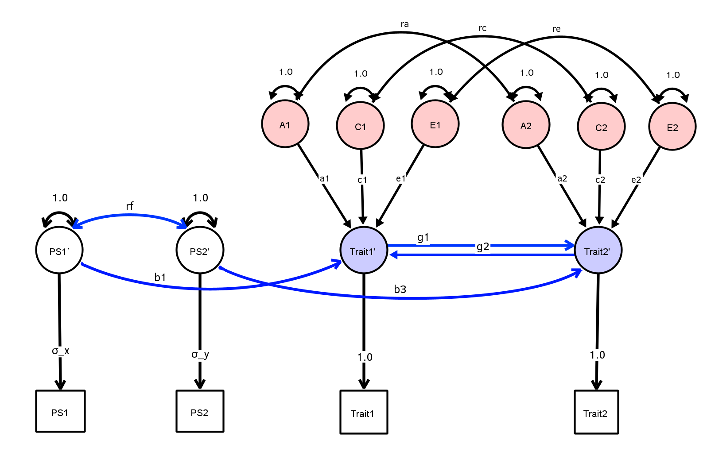
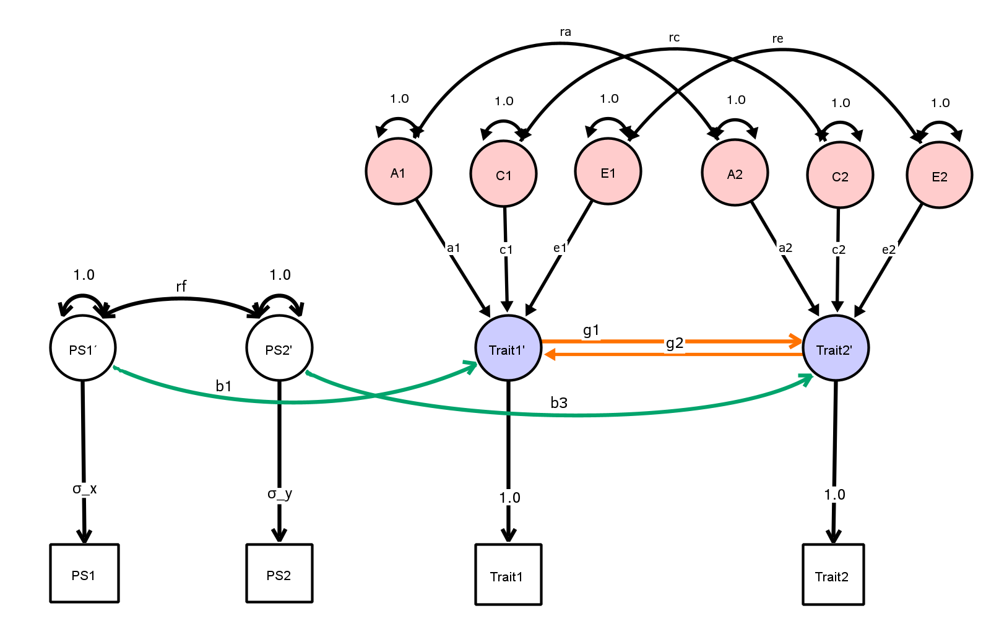
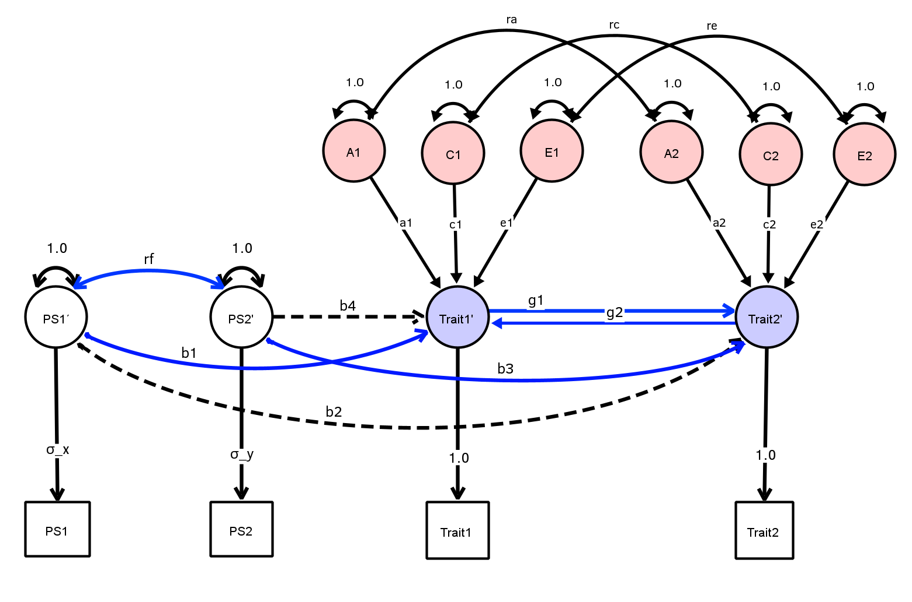
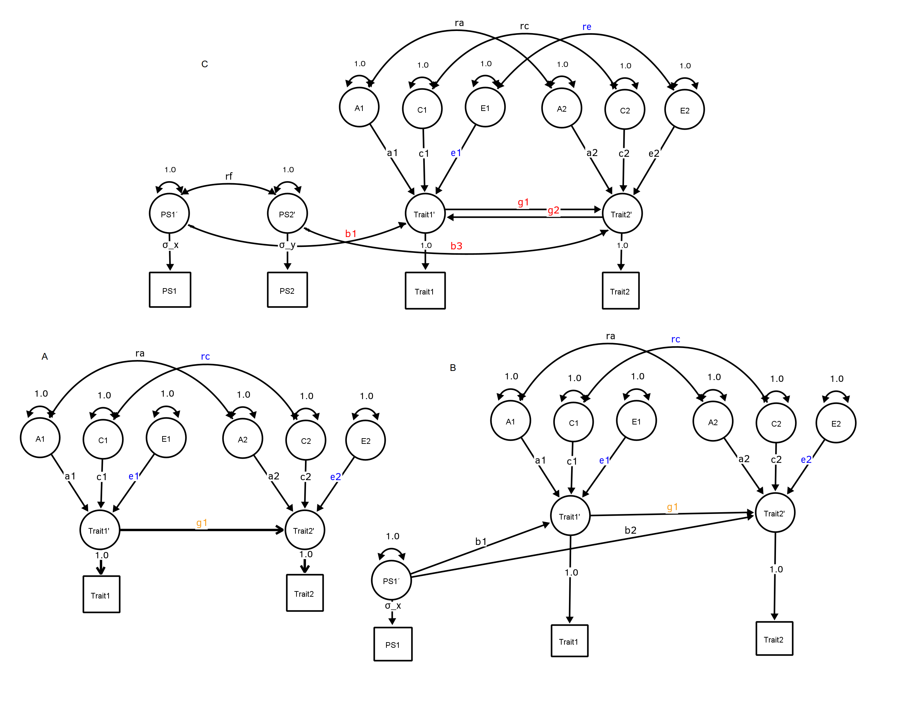
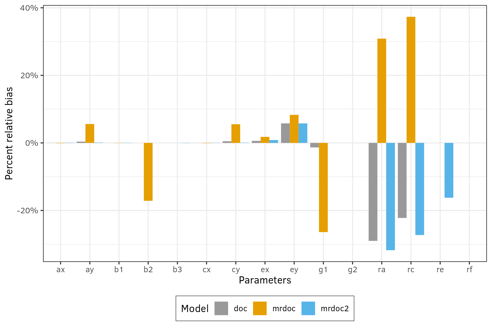
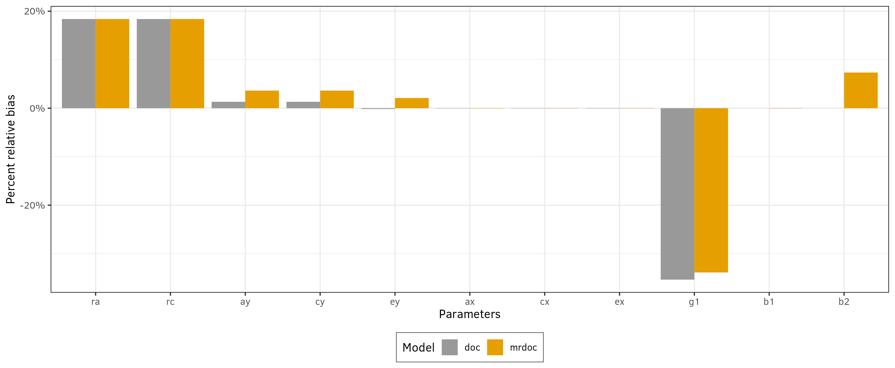
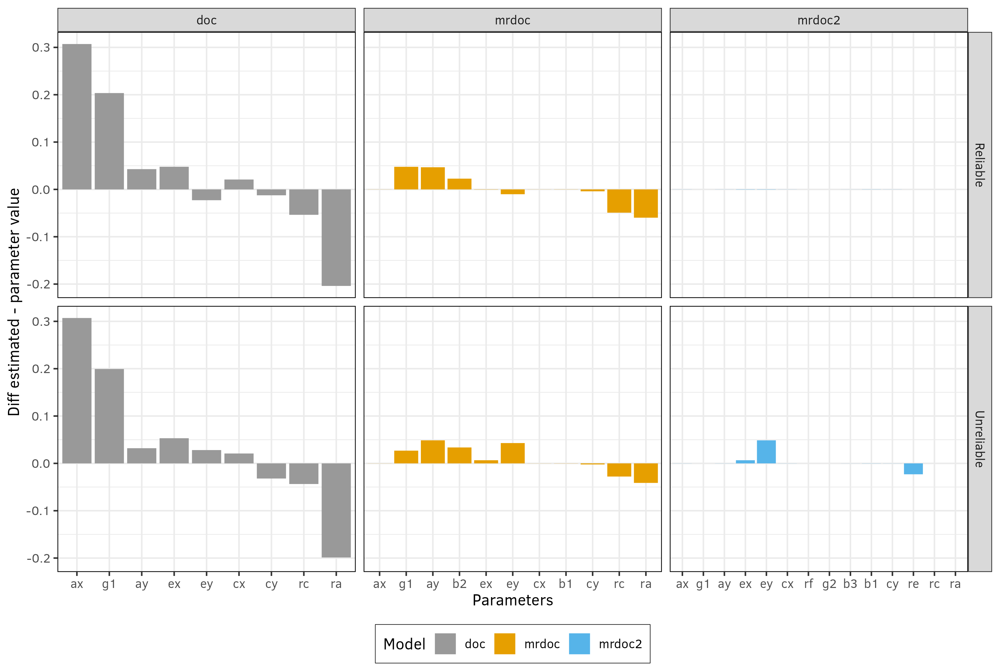
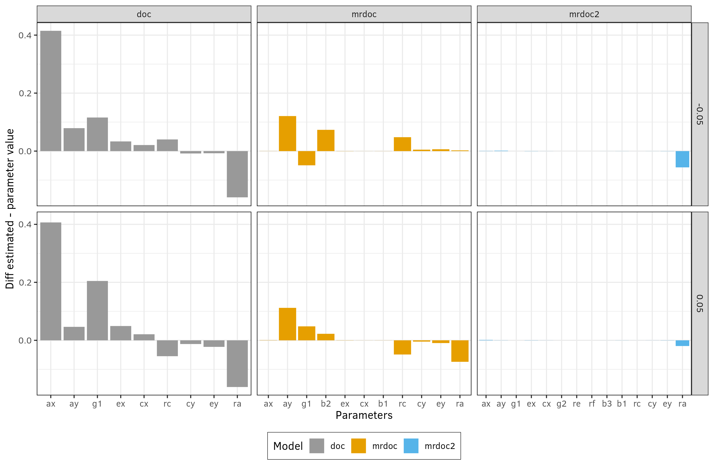
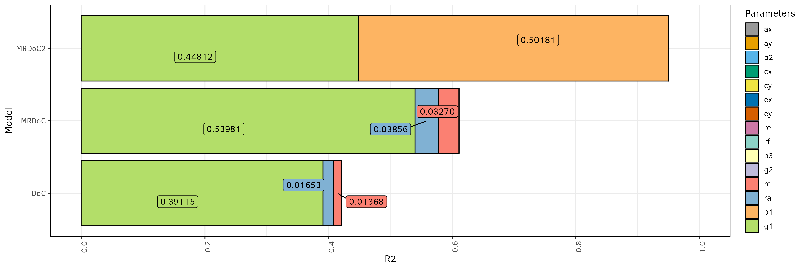

```{r setup, include=FALSE}

c("ProjectTemplate", "here", "TwoSampleMR", "stringr","patchwork","tidyverse","fmsb",
  "dplyr", "qrencoder", "knitr", "MASS", "quantreg", "ggplot2") |>
  lapply(function(x) {
    if (!require(x, character.only = TRUE)) {
      install.packages(x, dependencies = TRUE)
      library(x)}})

set.seed(42) # setting seed for stochastic functions
setwd(here()) # needed as we are in /src, in linux here() should be used

load.project(cache = F) # Loading the project
pclean()

# R options
options(
  digits = 3, # Only two decimal digits
  scipen = 999 # Remove scientific notation
)


# Knitr options
knitr::opts_chunk$set(
  comment = NA, # remove comment symbol
  cache.path = "../cache/", # where should I save cache?
  fig.path = "../graphs/", # where should I save figures?
  echo = F, # dont echo by default
  cache = F, # dont cache by default
  fig.width = 10, # setting the best witdth for figures
  fig.height = 7, # best height
  dpi = 300, # high dpi for publication quality,
  error = FALSE # do not interrupt in case of errors
)

theme_luis  <- function() {
  return_theme <-  ggplot2::theme_bw(12) +
    ggplot2::theme( 
        panel.border = element_rect(colour = "black"),
        legend.background = element_rect(linetype = 1, size = 0.2, colour = 1),
        text = element_text(size = 13),
        axis.text = element_text(size = 12),
        element_line(size = 1))
}

cb_palette <- c(
  "#999999", "#E69F00", "#56B4E9", "#009E73",
  "#F0E442", "#0072B2", "#D55E00", "#CC79A7"
)

```

\section{Mendelian Randomization}

# Intro

- Problems with observational data
- Randomized controlled trials
- Mendelian Randomization (MR):
  - How it works
  - Core assumptions


# The Problem with Inferring Causality in Observational Studies [@stampferVitaminConsumptionRisk1993]

```{r out.width="60%", fig.cap=" Age-Adjusted Relative Risks of Major Coronary Heart Disease, According to Quintile Group for Total Vitamin E Intake and Intake of Vitamin E from Dietary Sources"}

# create a tibble with stampfer results
stampfer <- tibble(
                   parameter = c("Q1", "Q2", "Q3", "Q4", "Q5"),
                   point = c(1, 1, 1.15, .74, .66),
                   low = c(0, .78, .9, .57, .5),
                   high = c(0, 1.28, 1.48, .98, .87))

# flipped point in range
stampfer %>%
  ggplot(aes(x=parameter, y = point, ymin = low, ymax = high) ) +
    geom_pointrange(size=1) +
    geom_hline(yintercept = 1, linetype = 2, color = "red") +
    theme_luis() +
    labs(x = "Quantiles of increasing Vit E intake", y = "Relative risk") +
    theme_luis()

```


# Use of vitamin supplements by US adults, 1987-2000 [@millenUseVitaminMineral2004]

```{r out.width="65%", fig.align="center", fig.cap="Use of vitamin supplements by US adults, 1987-2000. National Health Interview Surveys"}
# Year         1987       1992  2000 
# Multivitamin 17.4⫾0.4 19.3⫾0.4 27.9⫾0.3**
# Vit E 4.1⫾0.2 4.4⫾0.2 11.4
# Vit C 7.6⫾0.27.5⫾0.3 10.8

# Create a tibble with the data above
vitamins <- tibble(
  year = c(1987, 1992, 2000),
  multivitamin = c(17.4, 19.3, 27.9),
  vit_e = c(4.1, 4.4, 11.4),
  vit_c = c(7.6, 7.5, 10.8)
)

# Plot in ggplot bar 
vitamins %>%
  gather(key = "vitamin", value = "percentage", -year) %>%
  ggplot(aes(x = as.factor(year), y = percentage, fill = vitamin)) +
  geom_col(position = "dodge") +
  theme_luis() +
  # on the cb_palette
  scale_fill_manual(values = cb_palette[1:3]) +
  # legend on bottom
  theme(legend.position = "bottom") +
  labs(x = "Year", y = "Percentage of US adults") 


```

# Vitamin E supplement use and risk of Coronary Heart Disease [@stampferVitaminConsumptionRisk1993; @rimmVitaminConsumptionRisk1993; @eidelmanRandomizedTrialsVitamin2004]

```{r out.width="66%", fig.align="center" }


# Now a point in line with the last quantiles from stampfer, rimm, and results from RCTs
studies <- tibble(
  study = c("Stampfer1993", "Rimm1993", "RCTs2004"),
  point = c(.66, .65, .98),
  low = c(0.5, 0.46, 0.95),
  high = c(.87, .92, 1.03)
)

# point in line
studies %>%
  ggplot(aes(x=study, y = point, ymin = low, ymax = high) ) +
  geom_pointrange(size=1) +
  geom_hline(yintercept = 1, linetype = 2, color = "red") +
  theme_luis() +
  labs(x = "", y = "") +
  coord_flip() +
  theme_luis()


```

# MANY OTHER EXAMPLES {.standout}

- VITAMIN C, VITAMIN A, HRT,
- MANY DRUG TARGETS.......
- WHAT'S THE EXPLANATION?

# Vitamin E levels and confounding risk factors:

:::::::::::::: {.columns}
::: {.column width="50%"}

## Reduces Vitamin E levels

- Childhood SES [@lawlorThoseConfoundedVitamins2004]
- Manual social class
- No car access
- State pension only
- Smoker
- Obese


:::
::: {.column width="50%"}


## Increases Vitamin E levels

- Daily alcohol
- Exercise
- Low fat diet
- Height
- Leg length

:::
::::::::::::::

# Classic limitations of observational studies

:::::::::::::: {.columns}
::: {.column width="40%"}

- Confounding

```{r out.width="100%", fig.align="center"}

shorten_dag_arrows <- function(tidy_dag, shorten_distance){
  # Update underlying ggdag object
  tidy_dag$data <- dplyr::mutate(tidy_dag$data, slope = (yend - y) / (xend - x), # Calculate slope of line
                  distance = sqrt((xend-x)^2 + (yend - y)^2), # Calculate total distance of line
                  proportion = shorten_distance/distance, # Calculate proportion by which to be shortened
                  xend = (1-proportion)*xend + (proportion*x), # Shorten xend
                  yend = (1-proportion)*yend + (proportion*y)) %>% # Shorten yend
    dplyr::select(-slope, -distance, -proportion) # Drop intermediate values
  return(tidy_dag)
}
coord_dag <- list(
                  x = c(out = 2, exp = 1, L1 = 1.5),
                  y = c(out = 1, exp = 1, L1 = 2)
)

dagify(out ~ exp,
       exp ~ L1,
       out ~ L1,
       coords = coord_dag,
       exposure = "exp",
       outcome = "out") %>%
  tidy_dagitty() %>%
  shorten_dag_arrows(0.04) %>%
  ggdag() +
         geom_dag_point(size = 30) +
         geom_dag_edges() +
         geom_dag_text(colour = 'white', size = 5) +
  theme_dag() 


```


:::
::: {.column width="60%"}


- Direction of  causation is uncertain


```{r out.width="40%", fig.align="center"}

# reverse causation using ggdag

dagify(exp ~ out,
  out ~ exp,
  exposure = "exp",
  outcome = "out") %>%
  tidy_dagitty() %>%
  shorten_dag_arrows(0.02) %>%
  ggdag() +
         geom_dag_point(size = 30) +
         geom_dag_edges() +
         geom_dag_text(colour = 'white', size = 5) +
  theme_dag() 


```


- Other biases, e.g. selection bias [@hernanStructuralApproachSelection2004]

```{r out.width="40%", fig.align="center"}


# selection bias using ggdag
coord_dag <- list(
                  x = c(hip = 2, est = 1, inf = 2, sel = 3),
                  y = c(hip = 2, est = 1, inf = 1, sel = 1)
)
dagify(hip ~ est,
sel ~ hip ,
sel ~ inf,
coords = coord_dag,
exposure= "est",
outcome="inf") %>%
  tidy_dagitty() %>%
  shorten_dag_arrows(0.04) %>%
  ggdag() +
         geom_dag_point(size = 30) +
         geom_dag_edges() +
         geom_dag_text(colour = 'white', size = 5) +
  theme_dag() 

# collider bias using ggdag

```

:::
::::::::::::::


#  Causal inference, gold standard: randomized controlled trial [@cameliaMendelianRandomization2017]

\resizebox {\textheight} {!} {

\tikzset{every picture/.style={line width=0.75pt}} 

\begin{tikzpicture}[x=0.75pt,y=0.75pt,yscale=-1,xscale=1]
%uncomment if require: \path (0,406); %set diagram left start at 0, and has height of 406

%Shape: Rectangle [id:dp09013119193491881] 
\draw   (89.51,54.79) -- (440.51,54.79) -- (440.51,82.79) -- (89.51,82.79) -- cycle ;
%Shape: Rectangle [id:dp07466922112766006] 
\draw  [color={rgb, 255:red, 208; green, 2; blue, 27 }  ,draw opacity=1 ] (91.51,111.79) -- (439.51,111.79) -- (439.51,139.79) -- (91.51,139.79) -- cycle ;
%Shape: Rectangle [id:dp9690588436181429] 
\draw   (90,170.79) -- (172.51,170.79) -- (172.51,198.79) -- (90,198.79) -- cycle ;

%Shape: Rectangle [id:dp6239769035495455] 
\draw   (331.51,172.79) -- (440.51,172.79) -- (440.51,200.79) -- (331.51,200.79) -- cycle ;

%Shape: Rectangle [id:dp09311794295724285] 
\draw   (89.51,254.79) -- (439.51,254.79) -- (439.51,277.79) -- (89.51,277.79) -- cycle ;
%Shape: Cloud [id:dp39238737950916014] 
\draw   (195.42,186.18) .. controls (194.32,179.47) and (197.93,172.83) .. (204.72,169.07) .. controls (211.5,165.32) and (220.28,165.11) .. (227.31,168.53) .. controls (229.8,164.63) and (234.37,161.94) .. (239.62,161.27) .. controls (244.87,160.59) and (250.19,162.02) .. (253.98,165.12) .. controls (256.1,161.59) and (260.27,159.21) .. (265.01,158.84) .. controls (269.74,158.46) and (274.38,160.15) .. (277.26,163.29) .. controls (281.1,159.54) and (287.2,157.96) .. (292.93,159.24) .. controls (298.66,160.51) and (302.98,164.41) .. (304.04,169.25) .. controls (308.74,170.32) and (312.65,173.02) .. (314.77,176.67) .. controls (316.89,180.32) and (317,184.56) .. (315.08,188.28) .. controls (319.71,193.29) and (320.79,199.95) .. (317.93,205.79) .. controls (315.06,211.64) and (308.68,215.78) .. (301.15,216.67) .. controls (301.1,222.15) and (297.48,227.18) .. (291.69,229.82) .. controls (285.9,232.46) and (278.84,232.3) .. (273.23,229.4) .. controls (270.84,235.96) and (264.12,240.8) .. (255.97,241.81) .. controls (247.82,242.82) and (239.7,239.82) .. (235.12,234.12) .. controls (229.51,236.93) and (222.77,237.74) .. (216.44,236.36) .. controls (210.1,234.99) and (204.69,231.55) .. (201.43,226.81) .. controls (195.7,227.37) and (190.15,224.9) .. (187.55,220.63) .. controls (184.94,216.36) and (185.84,211.2) .. (189.78,207.71) .. controls (184.67,205.2) and (182.06,200.24) .. (183.31,195.4) .. controls (184.57,190.57) and (189.41,186.95) .. (195.31,186.44) ; \draw   (189.79,207.71) .. controls (192.2,208.89) and (194.99,209.42) .. (197.78,209.24)(201.43,226.81) .. controls (202.63,226.69) and (203.81,226.45) .. (204.93,226.08)(235.12,234.12) .. controls (234.28,233.07) and (233.57,231.94) .. (233.01,230.76)(273.23,229.4) .. controls (273.67,228.2) and (273.95,226.97) .. (274.07,225.72)(301.15,216.67) .. controls (301.21,210.83) and (297.22,205.49) .. (290.89,202.93)(315.08,188.28) .. controls (314.06,190.27) and (312.49,192.03) .. (310.51,193.43)(304.04,169.25) .. controls (304.21,170.05) and (304.29,170.87) .. (304.28,171.68)(277.26,163.29) .. controls (276.3,164.23) and (275.52,165.27) .. (274.92,166.39)(253.98,165.12) .. controls (253.47,165.97) and (253.09,166.87) .. (252.85,167.8)(227.31,168.53) .. controls (228.8,169.26) and (230.18,170.13) .. (231.41,171.13)(195.42,186.18) .. controls (195.57,187.11) and (195.81,188.02) .. (196.14,188.91) ;

%Straight Lines [id:da5448896029118211] 
\draw [line width=1.5]    (260.51,83.79) -- (260.51,108.79) ;
\draw [shift={(260.51,111.79)}, rotate = 270] [color={rgb, 255:red, 0; green, 0; blue, 0 }  ][line width=1.5]    (14.21,-4.28) .. controls (9.04,-1.82) and (4.3,-0.39) .. (0,0) .. controls (4.3,0.39) and (9.04,1.82) .. (14.21,4.28)   ;
%Straight Lines [id:da2621141017530124] 
\draw [line width=1.5]    (133.51,142.79) -- (133.51,167.79) ;
\draw [shift={(133.51,170.79)}, rotate = 270] [color={rgb, 255:red, 0; green, 0; blue, 0 }  ][line width=1.5]    (14.21,-4.28) .. controls (9.04,-1.82) and (4.3,-0.39) .. (0,0) .. controls (4.3,0.39) and (9.04,1.82) .. (14.21,4.28)   ;
%Straight Lines [id:da04700746963577296] 
\draw [line width=1.5]    (381.51,141.79) -- (381.51,166.79) ;
\draw [shift={(381.51,169.79)}, rotate = 270] [color={rgb, 255:red, 0; green, 0; blue, 0 }  ][line width=1.5]    (14.21,-4.28) .. controls (9.04,-1.82) and (4.3,-0.39) .. (0,0) .. controls (4.3,0.39) and (9.04,1.82) .. (14.21,4.28)   ;
%Straight Lines [id:da6279343979702607] 
\draw [line width=1.5]    (382.51,200.79) -- (382.51,250.79) ;
\draw [shift={(382.51,253.79)}, rotate = 270] [color={rgb, 255:red, 0; green, 0; blue, 0 }  ][line width=1.5]    (14.21,-4.28) .. controls (9.04,-1.82) and (4.3,-0.39) .. (0,0) .. controls (4.3,0.39) and (9.04,1.82) .. (14.21,4.28)   ;
%Straight Lines [id:da28108528172429614] 
\draw [line width=1.5]    (132.51,200.79) -- (132.51,250.79) ;
\draw [shift={(132.51,253.79)}, rotate = 270] [color={rgb, 255:red, 0; green, 0; blue, 0 }  ][line width=1.5]    (14.21,-4.28) .. controls (9.04,-1.82) and (4.3,-0.39) .. (0,0) .. controls (4.3,0.39) and (9.04,1.82) .. (14.21,4.28)   ;

% Text Node
\draw (204.89,60) node [anchor=north west][inner sep=0.75pt]   [align=left] {Eligible participants};
% Text Node
\draw (102.95,176) node [anchor=north west][inner sep=0.75pt]   [align=left] {Placebo};
% Text Node
\draw (349.39,178) node [anchor=north west][inner sep=0.75pt]   [align=left] {Treatment};
% Text Node
\draw (198,117) node [anchor=north west][inner sep=0.75pt]   [align=left] {Random assignment};
% Text Node
\draw (205,174) node [anchor=north west][inner sep=0.75pt]   [align=left] {{\scriptsize  \ \ \ Confounders}\\{\scriptsize on average balanced}\\{\scriptsize between groups}};
% Text Node
\draw (161,257.79) node [anchor=north west][inner sep=0.75pt]   [align=left] {Compare average outcomes};


\end{tikzpicture}
}


# The Need for Observational Studies

## Randomized Controlled Trials (RCTs):
- Not always ethical or practically feasible eg anything toxic\
- Expensive, requires experimentation in humans\
- Impractical for long follow up times\
- Should only be conducted on interventions that show very strong
- Observational evidence in humans

## Observational studies:

- Association between environmental exposures and disease measured in observational designs (non-experimental) eg case-control studies or cohort studies

- Reliably assigning causality in these types of studies is ***very limited***


# The Wide Applicability of MR

- Traditional Observational Epidemiological Studies
- Behavior Genetics and the Social Sciences
- Molecular Studies
- Pharmacogenomics

#  {.standout}

How does Mendelian randomization work?

# What does MR do?

- Assess causal relationship between two variables
- Estimate magnitude of causal effect

## How does it do this?

- By harnessing Mendel's laws of inheritance


# Mendel's Laws of Inheritance

:::::::::::::: {.columns}
::: {.column width="40%"}

## Gregor Mendel

```{r out.width="100%"}
knitr::include_graphics("../graphs/image19.png")
```

:::
::: {.column width="60%"}

## Mendel's Laws of Inheritance

1. Segregation: alleles separate at meiosis and a randomly selected allele is transmitted to offspring

2. Independent assortment: alleles for separate traits are transmitted independently of one another Mendel in 1862

:::
::::::::::::::

# Meiosis

:::::::::::::: {.columns}
::: {.column width="40%"}

```{r out.width="80%", fig.align="center"}
knitr::include_graphics("../graphs/meiosis_yourgenome.png")
```

:::
::: {.column width="60%"}

- Two cell divisions
- Produces four daughter cells
- Produces haploid cells
- Daughter cells are non-identical
- Produces sex cells
- Crossing-over occurs
- Homologous chromosomes pair up 
  - and are separated at random (independent segregation)

:::
::::::::::::::


# Add discussion from the autor here

# Mendelian randomization basic idea

> The genotype only affects the disease status indirectly and is assigned randomly (given the parents' genes) at
meiosis, independently of the possible confounding factors. It is well known in the econometrics and causal literature, and slowly being recognized in the epidemiological
literature that these properties define an instrumental variable (IV) [@didelezMendelianRandomizationInstrumental2007]

# Analogy RCT -  Mendelian Randomization [@cameliaMendelianRandomization2017; @costetPCSK9LDLCholesterol2008]


\resizebox {\textheight} {!} {


\tikzset{every picture/.style={line width=0.75pt}} %set default line width to 0.75pt        

\begin{tikzpicture}[x=0.75pt,y=0.75pt,yscale=-1,xscale=1]
%uncomment if require: \path (0,406); %set diagram left start at 0, and has height of 406

%Shape: Rectangle [id:dp09013119193491881] 
\draw  [color={rgb, 255:red, 0; green, 0; blue, 0 }  ,draw opacity=1 ] (89.51,69.79) -- (301.02,69.79) -- (301.02,93.04) -- (89.51,93.04) -- cycle ;
%Shape: Rectangle [id:dp1138343991777091] 
\draw  [color={rgb, 255:red, 0; green, 0; blue, 0 }  ,draw opacity=1 ] (89.02,111.79) -- (301.41,111.79) -- (301.41,132.74) -- (89.02,132.74) -- cycle ;
%Shape: Rectangle [id:dp9690588436181429] 
\draw  [color={rgb, 255:red, 0; green, 0; blue, 0 }  ,draw opacity=1 ] (91.02,156.56) -- (190.02,156.56) -- (190.02,178.04) -- (91.02,178.04) -- cycle ;

%Shape: Rectangle [id:dp6239769035495455] 
\draw  [color={rgb, 255:red, 0; green, 0; blue, 0 }  ,draw opacity=1 ] (193.02,156.45) -- (301.26,156.45) -- (301.26,178.29) -- (193.02,178.29) -- cycle ;

%Straight Lines [id:da45788790072527963] 
\draw [color={rgb, 255:red, 0; green, 0; blue, 0 }  ,draw opacity=1 ][line width=1.5]    (141.15,133.99) -- (141.15,151.95) ;
\draw [shift={(141.15,154.95)}, rotate = 270] [color={rgb, 255:red, 0; green, 0; blue, 0 }  ,draw opacity=1 ][line width=1.5]    (14.21,-4.28) .. controls (9.04,-1.82) and (4.3,-0.39) .. (0,0) .. controls (4.3,0.39) and (9.04,1.82) .. (14.21,4.28)   ;
%Straight Lines [id:da7866948802592717] 
\draw [color={rgb, 255:red, 0; green, 0; blue, 0 }  ,draw opacity=1 ][line width=1.5]    (245.29,134.24) -- (245.29,152.2) ;
\draw [shift={(245.29,155.2)}, rotate = 270] [color={rgb, 255:red, 0; green, 0; blue, 0 }  ,draw opacity=1 ][line width=1.5]    (14.21,-4.28) .. controls (9.04,-1.82) and (4.3,-0.39) .. (0,0) .. controls (4.3,0.39) and (9.04,1.82) .. (14.21,4.28)   ;
%Shape: Rectangle [id:dp4127490584755418] 
\draw  [color={rgb, 255:red, 0; green, 0; blue, 0 }  ,draw opacity=1 ] (91.02,200.56) -- (189.02,200.56) -- (189.02,222.04) -- (91.02,222.04) -- cycle ;
%Shape: Rectangle [id:dp4735789734124094] 
\draw  [color={rgb, 255:red, 0; green, 0; blue, 0 }  ,draw opacity=1 ] (192.02,200.45) -- (300.26,200.45) -- (300.26,222.29) -- (192.02,222.29) -- cycle ;
%Shape: Rectangle [id:dp28769473574519955] 
\draw  [color={rgb, 255:red, 0; green, 0; blue, 0 }  ,draw opacity=1 ] (91.02,243.56) -- (190.11,243.56) -- (190.11,265.04) -- (91.02,265.04) -- cycle ;

%Shape: Rectangle [id:dp14544770880087965] 
\draw  [color={rgb, 255:red, 0; green, 0; blue, 0 }  ,draw opacity=1 ] (192.02,243.45) -- (300.26,243.45) -- (300.26,265.29) -- (192.02,265.29) -- cycle ;
%Straight Lines [id:da472233837345017] 
\draw [color={rgb, 255:red, 0; green, 0; blue, 0 }  ,draw opacity=1 ][line width=1.5]    (139.15,178.99) -- (139.15,196.95) ;
\draw [shift={(139.15,199.95)}, rotate = 270] [color={rgb, 255:red, 0; green, 0; blue, 0 }  ,draw opacity=1 ][line width=1.5]    (14.21,-4.28) .. controls (9.04,-1.82) and (4.3,-0.39) .. (0,0) .. controls (4.3,0.39) and (9.04,1.82) .. (14.21,4.28)   ;
%Straight Lines [id:da390269523331114] 
\draw [color={rgb, 255:red, 0; green, 0; blue, 0 }  ,draw opacity=1 ][line width=1.5]    (243.29,179.24) -- (243.29,197.2) ;
\draw [shift={(243.29,200.2)}, rotate = 270] [color={rgb, 255:red, 0; green, 0; blue, 0 }  ,draw opacity=1 ][line width=1.5]    (14.21,-4.28) .. controls (9.04,-1.82) and (4.3,-0.39) .. (0,0) .. controls (4.3,0.39) and (9.04,1.82) .. (14.21,4.28)   ;
%Straight Lines [id:da23267534581244886] 
\draw [color={rgb, 255:red, 0; green, 0; blue, 0 }  ,draw opacity=1 ][line width=1.5]    (140.15,221.99) -- (140.15,239.95) ;
\draw [shift={(140.15,242.95)}, rotate = 270] [color={rgb, 255:red, 0; green, 0; blue, 0 }  ,draw opacity=1 ][line width=1.5]    (14.21,-4.28) .. controls (9.04,-1.82) and (4.3,-0.39) .. (0,0) .. controls (4.3,0.39) and (9.04,1.82) .. (14.21,4.28)   ;
%Straight Lines [id:da8559200544433885] 
\draw [color={rgb, 255:red, 0; green, 0; blue, 0 }  ,draw opacity=1 ][line width=1.5]    (244.29,222.24) -- (244.29,240.2) ;
\draw [shift={(244.29,243.2)}, rotate = 270] [color={rgb, 255:red, 0; green, 0; blue, 0 }  ,draw opacity=1 ][line width=1.5]    (14.21,-4.28) .. controls (9.04,-1.82) and (4.3,-0.39) .. (0,0) .. controls (4.3,0.39) and (9.04,1.82) .. (14.21,4.28)   ;
%Shape: Rectangle [id:dp15823606977740523] 
\draw  [color={rgb, 255:red, 208; green, 2; blue, 27 }  ,draw opacity=1 ] (314.51,69.79) -- (526.02,69.79) -- (526.02,93.04) -- (314.51,93.04) -- cycle ;
%Shape: Rectangle [id:dp21435354228682013] 
\draw  [color={rgb, 255:red, 208; green, 2; blue, 27 }  ,draw opacity=1 ] (314.02,111.79) -- (526.41,111.79) -- (526.41,132.74) -- (314.02,132.74) -- cycle ;
%Shape: Rectangle [id:dp8738351049153021] 
\draw  [color={rgb, 255:red, 208; green, 2; blue, 27 }  ,draw opacity=1 ] (316.02,156.56) -- (415.02,156.56) -- (415.02,178.04) -- (316.02,178.04) -- cycle ;
%Shape: Rectangle [id:dp45776597282535114] 
\draw  [color={rgb, 255:red, 208; green, 2; blue, 27 }  ,draw opacity=1 ] (418.02,156.45) -- (526.26,156.45) -- (526.26,178.29) -- (418.02,178.29) -- cycle ;
%Straight Lines [id:da5975721940524428] 
\draw [color={rgb, 255:red, 208; green, 2; blue, 27 }  ,draw opacity=1 ][line width=1.5]    (366.15,133.99) -- (366.15,151.95) ;
\draw [shift={(366.15,154.95)}, rotate = 270] [color={rgb, 255:red, 208; green, 2; blue, 27 }  ,draw opacity=1 ][line width=1.5]    (14.21,-4.28) .. controls (9.04,-1.82) and (4.3,-0.39) .. (0,0) .. controls (4.3,0.39) and (9.04,1.82) .. (14.21,4.28)   ;
%Straight Lines [id:da9671220095737316] 
\draw [color={rgb, 255:red, 208; green, 2; blue, 27 }  ,draw opacity=1 ][line width=1.5]    (470.29,134.24) -- (470.29,152.2) ;
\draw [shift={(470.29,155.2)}, rotate = 270] [color={rgb, 255:red, 208; green, 2; blue, 27 }  ,draw opacity=1 ][line width=1.5]    (14.21,-4.28) .. controls (9.04,-1.82) and (4.3,-0.39) .. (0,0) .. controls (4.3,0.39) and (9.04,1.82) .. (14.21,4.28)   ;
%Shape: Rectangle [id:dp5030193252802866] 
\draw  [color={rgb, 255:red, 208; green, 2; blue, 27 }  ,draw opacity=1 ] (316.02,200.56) -- (414.02,200.56) -- (414.02,222.04) -- (316.02,222.04) -- cycle ;
%Shape: Rectangle [id:dp9701059530643161] 
\draw  [color={rgb, 255:red, 208; green, 2; blue, 27 }  ,draw opacity=1 ] (417.02,200.45) -- (525.26,200.45) -- (525.26,222.29) -- (417.02,222.29) -- cycle ;
%Shape: Rectangle [id:dp6689503147345437] 
\draw  [color={rgb, 255:red, 208; green, 2; blue, 27 }  ,draw opacity=1 ] (316.02,243.56) -- (415.11,243.56) -- (415.11,265.04) -- (316.02,265.04) -- cycle ;

%Shape: Rectangle [id:dp5411042648591329] 
\draw  [color={rgb, 255:red, 208; green, 2; blue, 27 }  ,draw opacity=1 ] (417.02,243.45) -- (525.26,243.45) -- (525.26,265.29) -- (417.02,265.29) -- cycle ;
%Straight Lines [id:da7154750287536058] 
\draw [color={rgb, 255:red, 208; green, 2; blue, 27 }  ,draw opacity=1 ][line width=1.5]    (364.15,178.99) -- (364.15,196.95) ;
\draw [shift={(364.15,199.95)}, rotate = 270] [color={rgb, 255:red, 208; green, 2; blue, 27 }  ,draw opacity=1 ][line width=1.5]    (14.21,-4.28) .. controls (9.04,-1.82) and (4.3,-0.39) .. (0,0) .. controls (4.3,0.39) and (9.04,1.82) .. (14.21,4.28)   ;
%Straight Lines [id:da7914968688037842] 
\draw [color={rgb, 255:red, 208; green, 2; blue, 27 }  ,draw opacity=1 ][line width=1.5]    (468.29,179.24) -- (468.29,197.2) ;
\draw [shift={(468.29,200.2)}, rotate = 270] [color={rgb, 255:red, 208; green, 2; blue, 27 }  ,draw opacity=1 ][line width=1.5]    (14.21,-4.28) .. controls (9.04,-1.82) and (4.3,-0.39) .. (0,0) .. controls (4.3,0.39) and (9.04,1.82) .. (14.21,4.28)   ;
%Straight Lines [id:da95323390220036] 
\draw [color={rgb, 255:red, 208; green, 2; blue, 27 }  ,draw opacity=1 ][line width=1.5]    (365.15,221.99) -- (365.15,239.95) ;
\draw [shift={(365.15,242.95)}, rotate = 270] [color={rgb, 255:red, 208; green, 2; blue, 27 }  ,draw opacity=1 ][line width=1.5]    (14.21,-4.28) .. controls (9.04,-1.82) and (4.3,-0.39) .. (0,0) .. controls (4.3,0.39) and (9.04,1.82) .. (14.21,4.28)   ;
%Straight Lines [id:da3219069749771628] 
\draw [color={rgb, 255:red, 208; green, 2; blue, 27 }  ,draw opacity=1 ][line width=1.5]    (469.29,222.24) -- (469.29,240.2) ;
\draw [shift={(469.29,243.2)}, rotate = 270] [color={rgb, 255:red, 208; green, 2; blue, 27 }  ,draw opacity=1 ][line width=1.5]    (14.21,-4.28) .. controls (9.04,-1.82) and (4.3,-0.39) .. (0,0) .. controls (4.3,0.39) and (9.04,1.82) .. (14.21,4.28)   ;

% Text Node
\draw (102.51,72.79) node [anchor=north west][inner sep=0.75pt]   [align=left] {Randomized controlled trial};
% Text Node
\draw (112.15,158.58) node [anchor=north west][inner sep=0.75pt]   [align=left] {Placebo};
% Text Node
\draw (210.53,158.65) node [anchor=north west][inner sep=0.75pt]   [align=left] {Treatment};
% Text Node
\draw (127.57,113.55) node [anchor=north west][inner sep=0.75pt]   [align=left] {Random assignment};
% Text Node
\draw (93.27,203.58) node [anchor=north west][inner sep=0.75pt]   [align=left] {Higher LDL-c};
% Text Node
\draw (200.27,203.58) node [anchor=north west][inner sep=0.75pt]   [align=left] {Lower LDL-c};
% Text Node
\draw (90.19,246.58) node [anchor=north west][inner sep=0.75pt]   [align=left] {Higher HD risk };
% Text Node
\draw (197.02,246.45) node [anchor=north west][inner sep=0.75pt]   [align=left] {Lower HD risk };
% Text Node
\draw (356.51,72.79) node [anchor=north west][inner sep=0.75pt]   [align=left] {MR: Nature's RCT};
% Text Node
\draw (352.57,113.55) node [anchor=north west][inner sep=0.75pt]   [align=left] {Random inheritance};
% Text Node
\draw (321.27,203.58) node [anchor=north west][inner sep=0.75pt]   [align=left] {Higher LDL-c};
% Text Node
\draw (425.27,203.58) node [anchor=north west][inner sep=0.75pt]   [align=left] {Lower LDL-c};
% Text Node
\draw (422.02,246.45) node [anchor=north west][inner sep=0.75pt]   [align=left] {Lower HD risk };
% Text Node
\draw (315.19,246.58) node [anchor=north west][inner sep=0.75pt]   [align=left] {Higher HD risk };
% Text Node
\draw (339.02,159.56) node [anchor=north west][inner sep=0.75pt]   [align=left] {PCSK9 -};
% Text Node
\draw (443.53,159.65) node [anchor=north west][inner sep=0.75pt]   [align=left] {PCSK9 +};


\end{tikzpicture}

}


# Similarities MR - RCT

```{r echo=FALSE,  fig.align='center', out.width='70%'}
knitr::include_graphics("../graphs/similarities.png")
```

[@ferenceUsingMendelianRandomization2021]


# Similarities MR - RCT [@sandersonMendelianRandomizationNature2022]

```{r echo=FALSE,  fig.align='center', out.width='60%', fig.cap="Illustration of a randomized control study and instrumental variable estimation. A randomized controlled trial (RCT) (panel a) and a Mendelian randomization (MR) study (panel b) to estimate the effect of lowering C-reactive protein (CRP) on systolic blood pressure (SBP). The arrows highlighted in red show the causal effect of interest."}
knitr::include_graphics("../graphs/rctvsmr.png")
```


# Instrumental variables

:::::::::::::: {.columns}
::: {.column width="40%"}

## Philip G Wright

```{r out.width="100%", fig.align="center"}

knitr::include_graphics("../graphs/Philip_Green_Wright_from_Carl_Sandburg_Home.jpg")

```

:::
::: {.column width="60%"}

\scriptsize

- Known for first description of the parameter identification problem
- The instrumental variables method [@timothybatesUsingModernSEMbased2022]

\scriptsize
  - Could supply and demand be derived from price/volume data? As price confounds both supply & demand, Wright deduced that to resolve them, he needed an "instrument" – Something affecting only one of demand or supply. With this, he could compute the curves he needed.

\scriptsize
  - Wright hit upon variation in rainfall. Rain didn't alter demand, but by increasing grass production, did impact butter supply. And thus the need to model food supply saw the first instrumental model conceived in 1938!
- Sewell Wright's dad!

:::
::::::::::::::


# Mendelian randomization  


- Uses genetic variants as instrumental variables [@richmondMendelianRandomizationConcepts2022]
- Helps understand causation, but has strong assumptions [@sandersonMendelianRandomizationNature2022]
  1. G (instrument) is robustly associated with X (“relevance”);
  2. G does not share common causes (C) with Y (Outcome) (“independence” or “exchangeability”); and
  3. G affects Y exclusively through its effect on X (“exclusion restriction”).
  4. No bidirectional causation between X and Y

```{r echo=FALSE,  fig.align='center', out.width='60%'}
knitr::include_graphics("../graphs/conditions.png")
```


# Mendelian Randomization 

  - Depends on intruments sufficiently predictive of exposure [@richmondMendelianRandomizationConcepts2022]
  - Psychiatric disorders polygenicity, weak instrument bias
  - Cause is  (typically) assessed in one direction

\vspace{3mm}

```{r out.width="100%", warning = F}
knitr::include_graphics("../graphs/bidirectional.png")
```


# Why are genetic associations special?

- Robustness to confounding due to Mendel's laws:
  - Law of segregation: inheritance of an allele is random and
independent of environment etc
  - Law of independent assortment: genes for different traits
segregate independently (assuming not in LD)

- The direction of causality is known -- always from SNP
to trait

- Genetic variants are **potentially** very good instrumental
variables

- Using genetic variants as IVs is a special case of IV
analysis, known as Mendelian randomization


#
\section{MR-DoC}

# Pleiotropy is pervasive 

:::::::::::::: {.columns}
::: {.column width="60%"}


- Genetic variant influences more than one trait
- Horizontal vs Vertical pleiotropy
  - It has a central role in the genetic architecture [@jordanHOPSQuantitativeScore2019]
  - Using MR-PRESSO found pleiotropy in over 48% of significant MR [@verbanckDetectionWidespreadHorizontal2018], with large distortions on MR estimates.

:::
::: {.column width="40%"}

```{r out.width="100%", warning = F}
knitr::include_graphics("../graphs/pleiotropy.png")
```
```{r out.width="100%", warning = F, fig.cap="(LD) and polygenicity are expected to contribute to horizontal pleiotropy"}
knitr::include_graphics("../graphs/pleiotropy2.png")
```


:::
::::::::::::::

# Linkage disequilibrium

```{r out.width="100%", warning = F, fig.align="center", fig.cap="a | An example of distinct causal variants that violate the instrumental variable assumption IV2. G1 and G2 represent two genetic variants and the link between them is non-directional, reflecting linkage disequilibrium. b,c | Examples of a shared causal variant are a violation of assumption IV2 (panel b) and a situation that satisfies the IV assumptions (panel c)."}
knitr::include_graphics("../graphs/ld.png")
```


# Structural equation modeling - equivalence to 2SLS 

:::::::::::::: {.columns}
::: {.column width="60%"}

- SEM solutions have been shown to recover exact estimates as 2SLS [@maydeu-olivaresInstrumentalVariablesTwoStage2019]
  - less convergence in weak instruments
  - slightly worse performance in ML-SEM


:::
::: {.column width="40%"}


```{r out.width="100%", warning = F, fig.align="center", fig.cap="Instrumental Variables Regression (IVR) model that enables drawing causal inferences on the target regression model"}
knitr::include_graphics("../graphs/maydeu.png")
```


:::
::::::::::::::

# Classic Direction of Causation model - reciprocal causation [@heathTestingHypothesesDirection1993]
:::::::::::::: {.columns}
::: {.column width="60%"}


# Model specification 

```{r, fig.align='center', out.width='100%'}
knitr::include_graphics("../graphs/DoC_onyx.pdf")
```

:::
::: {.column width="40%"}

## Path diagram representing a Bidirectional DoC for one twin.

\small
- causal paths are estimated affording information from the cross-twin cross-trait correlations. 
- Cross-twin covariance between additive genetic effects is 0.5 (not shown) for DZ twins, as DZs are expected to share 50% of the genetic effects.
- Standard SEM symbology is used. 


:::
::::::::::::::

# Classic Direction of Causation
:::::::::::::: {.columns}
::: {.column width="60%"}
 

# Model specification 


```{r, fig.align='center', out.width='100%'}
knitr::include_graphics("../graphs/DoC_onyx.pdf")
```

:::
::: {.column width="40%"}

## Problems

\small

- Not identified as depicted
- Bias at the phenotypic level [@gillespieDirectionCausationModeling2003]
- Bias due to E confounding [@rasmussenMajorLimitationDirection2019]
- Better detection of cause with different variance component proportions for each phenotype [@maesUsingMultimodelInference2021]

:::
::::::::::::::

# MR-DoC model [@minicaExtendingCausalityTests2018]

```{r out.width='75%', fig.align='center'}
knitr::include_graphics("../graphs/MR-DOC.pdf")
```

# MR-DoC - identified cases


| x  | aX | cX | eX | aY | cY | eY | ra | rc | re | b1 | b2 | g1 | Id |
|----|----|----|----|----|----|----|----|----|----|----|----|----|-------------|
| fr | fr | fr | fr | fr | fr | fr | fr | fr | fr | fr | fr | fr | No         |
| **fr** | **fr** | **fr** | **fr** | **fr** | **fr** | **fr** | **fr** | **fr** | **0** | **fr** | **fr** | **fr** | **Yes**         |
| **fr** | **fr** | **fr** | **fr** | **fr** | **fr** | **fr** | **fr** | **fr** | **fr** | **fr** | **0** | **fr** | **Yes**         |
| **fr** | **fr** | **fr** | **fr** | **fr** | **fr** | **fr** | **fr** | **0**  | **fr** | **fr**  | **fr** |  **fr** | **Yes**         |
|   fr   |   fr   |   0   |   fr   |   fr   |   0   |    fr   |   fr     | 0     | fr | fr | fr  |   fr | No          |
| **fr** | **fr** | **fr** | **fr** | **fr** | **0** |  **fr** | **fr** | **0**  | **fr** | **fr**  | **fr** |  **fr** | **Yes**         |
| fr | fr | 0  | fr | fr | fr | fr | fr | 0  | fr | fr | fr | fr | No          |


# MR-DoC - identified cases

\tiny

| x  | aX | cX | eX | aY | cY | eY | ra | rc | re | b1 | b2 | g1 | Id |
|----|----|----|----|----|----|----|----|----|----|----|----|----|-------------|
| fr | fr | fr | fr | fr | fr | fr | fr | fr | fr | fr | fr | fr | No         |
| **fr** | **fr** | **fr** | **fr** | **fr** | **fr** | **fr** | **fr** | **fr** | **0** | **fr** | **fr** | **fr** | **Yes**         |
| fr | fr | fr | fr | fr | fr | fr | fr | fr | fr | fr | 0  | fr | Yes         |
| fr | fr | fr | fr | fr | fr | fr | fr | 0  | fr | fr | fr | fr | Yes         |
| fr | fr | 0  | fr | fr | 0  | fr | fr | 0  | fr | fr | fr | fr | No          |
| fr | fr | fr | fr | fr | 0  | fr | fr | 0  | fr | fr | fr | fr | Yes         |
| fr | fr | 0  | fr | fr | fr | fr | fr | 0  | fr | fr | fr | fr | No          |


```{r out.width='50%', fig.align='center'}
knitr::include_graphics("../graphs/MR-DOC-re.pdf")
```

# MR-DoC - identified cases

\tiny

| x  | aX | cX | eX | aY | cY | eY | ra | rc | re | b1 | b2 | g1 | Id |
|----|----|----|----|----|----|----|----|----|----|----|----|----|-------------|
| fr | fr | fr | fr | fr | fr | fr | fr | fr | fr | fr | fr | fr | No         |
| fr | fr | fr | fr | fr | fr | fr | fr | fr | 0  | fr | fr | fr | Yes         |
| **fr** | **fr** | **fr** | **fr** | **fr** | **fr** | **fr** | **fr** | **fr** | **fr** | **fr** | **0** | **fr** | **Yes**         |
| fr | fr | fr | fr | fr | fr | fr | fr | 0  | fr | fr | fr | fr | Yes         |
| fr | fr | 0  | fr | fr | 0  | fr | fr | 0  | fr | fr | fr | fr | No          |
| fr | fr | fr | fr | fr | 0  | fr | fr | 0  | fr | fr | fr | fr | Yes         |
| fr | fr | 0  | fr | fr | fr | fr | fr | 0  | fr | fr | fr | fr | No          |


```{r out.width='50%', fig.align='center'}
knitr::include_graphics("../graphs/MR-DOC-b2.pdf")
```

# MR-DoC - identified cases

\tiny

| x  | aX | cX | eX | aY | cY | eY | ra | rc | re | b1 | b2 | g1 | Id |
|----|----|----|----|----|----|----|----|----|----|----|----|----|-------------|
| fr | fr | fr | fr | fr | fr | fr | fr | fr | fr | fr | fr | fr | No         |
| fr | fr | fr | fr | fr | fr | fr | fr | fr | 0  | fr | fr | fr | Yes         |
| fr | fr | fr | fr | fr | fr | fr | fr | fr | fr | fr | 0  | fr | Yes         |
| **fr** | **fr** | **fr** | **fr** | **fr** | **fr** | **fr** | **fr** | **0**  | **fr** | **fr**  | **fr** |  **fr** | **Yes**         |
| fr | fr | 0  | fr | fr | 0  | fr | fr | 0  | fr | fr | fr | fr | No          |
| fr | fr | fr | fr | fr | 0  | fr | fr | 0  | fr | fr | fr | fr | Yes         |
| fr | fr | 0  | fr | fr | fr | fr | fr | 0  | fr | fr | fr | fr | No          |


```{r out.width='50%', fig.align='center'}
knitr::include_graphics("../graphs/MR-DOC-rc.pdf")
```

# MR-DoC - identified cases

\tiny

| x  | aX | cX | eX | aY | cY | eY | ra | rc | re | b1 | b2 | g1 | Id |
|----|----|----|----|----|----|----|----|----|----|----|----|----|-------------|
| fr | fr | fr | fr | fr | fr | fr | fr | fr | fr | fr | fr | fr | No         |
| fr | fr | fr | fr | fr | fr | fr | fr | fr | 0  | fr | fr | fr | Yes         |
| fr | fr | fr | fr | fr | fr | fr | fr | fr | fr | fr | 0  | fr | Yes         |
| fr | fr | fr | fr | fr | fr | fr | fr | 0  | fr | fr | fr | fr | Yes         |
| fr | fr | 0  | fr | fr | 0  | fr | fr | 0  | fr | fr | fr | fr | No          |
| **fr** | **fr** | **fr** | **fr** | **fr** | **0** |  **fr** | **fr** | **0** | **fr** | **fr** | **fr** |  **fr** | **Yes**         |
| fr | fr | 0  | fr | fr | fr | fr | fr | 0  | fr | fr | fr | fr | No          |


```{r out.width='50%', fig.align='center'}
knitr::include_graphics("../graphs/MR-DOC-rc-c2.pdf")
```


# MR-DoC [@minicaExtendingCausalityTests2018]

```{r, fig.cap = "MR-DoC extension. Some confounding, not bidirectional. Not identified as depicted.", out.width="70%", warning = F}
knitr::include_graphics("../graphs/camelia.png")
```


#
\section{Bi-directional MR-DoC, MR-DoC2}

# MR-DoC2  

:::::::::::::: {.columns}
::: {.column width="60%"}

# Model specification 

```{r, fig.align='center', out.width='80%'}

```

:::
::: {.column width="40%"}

## Modified MR-DOC

\small

- Path diagram of the MR-DoC2 model for an individual. [@dolanIntroducingPolygenicRisk2020]
- The model includes the effects of additive genetic (A), common environment (C) and specific environment (E) factors for both X and Y, and their effects may correlate (parameters ra, rc and re). 

:::
::::::::::::::


# Results 

- Which  parameters drive power?

## Revisiting limitations

- Do we need phenotypes with distinct inheritance patterns
- What about measurement error at the phenotypic level?
- How robust it is regarding pleiotropy  
  
# Which  parameters drive power? [@vandersluisPowerCalculationsUsing2008]

:::::::::::::: {.columns}
::: {.column width="50%"}

\tiny

|          | g1 = 0 | g2 = 0 | g1 = g2 = 0 |
|----------|--------|--------|-------------|
| \color{orange}{g1}       | \color{orange}{0.517}  | \color{orange}{0.000}  | \color{orange}{0.289}       |
| \color{orange}{g2}       | \color{orange}{0.000}  | \color{orange}{0.517}  | \color{orange}{0.289}       |
| \color{teal}{b1}       | \color{teal}{0.365}  | \color{teal}{0.000}  | \color{teal}{0.181}       |
| \color{teal}{b3}       | \color{teal}{0.000}  | \color{teal}{0.365}  | \color{teal}{0.181}       |
| ra       | 0.000  | 0.000  | 0.000       |
| rc       | 0.000  | 0.000  | 0.000       |
| re       | 0.002  | 0.002  | 0.000       |
| rf       | 0.041  | 0.041  | 0.000       |
| ay       | 0.002  | 0.000  | 0.001       |
| ax       | 0.000  | 0.002  | 0.001       |
| cy       | 0.002  | 0.000  | 0.001       |
| cx       | 0.000  | 0.002  | 0.001       |
| Total R2 | 0.929  | 0.929  | 0.945       |
: Variance explained in statistical power (non-centrality parameter; NCP) by model parameters.

:::
::: {.column width="50%"}

\small
- Distinct inheritance patterns from phenotypes - not needed
- b1, b2, g1, and g2 are what drives power
- slightly better power without C variance

```{r, fig.align='center', out.width='85%'}

```


:::
::::::::::::::


# Factorial design simulation - factors
:::::::::::::: {.columns}
::: {.column width="70%"}

```{r out.width="90%" }
knitr::include_graphics("../graphs/fac-levels.png")
```
:::
:::::::::::::: {.column width="30%"}
Parameter levels on the three factorial designs, with respective total
number of cells for each design simulation. Also, ex was specified as
as 
$\sqrt{1-ax^2-cx^2}$
and ey as $\sqrt{1-ay^2-cy^2}$.
:::
::::::::::::::

# Power simulations [@vandersluisPowerCalculationsUsing2008]

\scriptsize

- Power simulations typically involve simulating many datasets corresponding to one true model and calculating the proportion of simulations where a given effect is significant. 

## Exact data simulation

1. choosing a set of parameter values for the model shown in Figure 2; 
2. exact data simulation, with arbitrary N=1,000 MZ pairs and N=1,000 DZ twin pairs; 
3. fitting the true model using ML estimation in OpenMx;
4. fitting the false model by fixing one or more parameters to zero and refitting the model; and
5. calculating the NCP and the power to reject the false model restrictions. 

- **Regressing the NCP on the parameters to work out which ones are important wrt power.**


# Revisiting limitations: Error at the phenotypic level

:::::::::::::: {.columns}
::: {.column width="70%"}


```{r out.width="90%" , fig.align="center"}
knitr::include_graphics("../graphs/reliability.png")
```

\tiny

$\theta$ = {b1 = c(sqrt(.05), sqrt(.1), sqrt(.15)), b3 =  c(sqrt(.05), sqrt(.1), sqrt(.15)), g1 = c(sqrt(.05), sqrt(.1), sqrt(.15)), g2 = c(sqrt(.05), sqrt(.1), sqrt(.15)), abs= .05,  ass = 0.05, cbs=0.05,  css=0.05,  ra=.224,  rc=.224,  re=.224, rf=.224, reliability =c(.0, .1, .2, .3, .4) 

:::
:::::::::::::: {.column width="30%"}

## Reliability 

\tiny

```
relB = var(B) / {var(B) + var(errorB)}
relS = var(S) / {var(S) + var(errorS)}
```

\small

- power reduces
- but no bias in estimation of b1, b3, g1, g2
:::
::::::::::::::

# Other types of  pleiotropy not included in the model

```{r out.width="80%" , fig.align="center"}

```


# Not robust to pleiotropy (b2 and b4 !=0)

:::::::::::::: {.columns}
::: {.column width="70%"}
```{r pleiotropy, out.width="90%"}
knitr::include_graphics("../graphs/horizontal_pleiotropy.png")
```
:::
:::::::::::::: {.column width="30%"}

\tiny

The red lines indicate the observed mean of the distribution of the estimated v while the 
blue lines indicated the simulated value for the parameter. If the  red line is on the right of the 
 blue line, then the parameter is overestimated and if the  red line is on the left of the 
blue line the parameter is underestimated.

\vspace{3mm}

Results from simulation with 1024 replications, with variation on the factor level of b2 and b4 (0, $\sqrt{.001}$, $\sqrt{.002}$, $\sqrt{.003}$, $\sqrt{.004}$). 
:::
::::::::::::::

# Reasonable sample sizes in relevant scenarios 


:::::::::::::: {.columns}
::: {.column width="60%"}

```{r onlyx, out.width="90%"}
knitr::include_graphics("../graphs/power-revision.png")
```

:::
::: {.column width="40%"}

\tiny

A and C variances for the groups: 

1. alcohol use (a^2^ 49%, c^2^ 10%) (Verhulst et al., 2015)  and heart disease (a^2^ 22%, c^2^ 0%)  (Wu et al., 2014); 
2. BMI (a^2^ 72%, c^2^ 3%)  (Rokholm et al., 2011)  and major depression
(a^2^ 37%, c^2^ 1%) (Scherrer et al., 2003); 
3. cannabis use (a^2^ 51%, c^2^ 20%) (Verweij et al., 2010) and
schizophrenia (a^2^ 81%, c^2^ 11%) (Sullivan et al., 2003); 
4. dyslipidemia (LDL) (a^2^ 60%, c^2^ 28%) (Zhang et al., 2010)
and heart disease  (a2 22%, c^2^ 0%) (Wu et al., 2014). 


:::
::::::::::::::


# Reasonable sample sizes in relevant scenarios 


:::::::::::::: {.columns}
::: {.column width="60%"}

```{r , out.width="90%"}
knitr::include_graphics("../graphs/power-revision.png")
```

:::
::: {.column width="40%"}

\tiny

A and C variances for the groups: 

1. alcohol use (a^2^ 49%, c^2^ 10%) (Verhulst et al., 2015)  and heart disease (a^2^ 22%, c^2^ 0%)  (Wu et al., 2014); 
2. BMI (a^2^ 72%, c^2^ 3%)  (Rokholm et al., 2011)  and major depression
(a^2^ 37%, c^2^ 1%) (Scherrer et al., 2003); 
3. cannabis use (a^2^ 51%, c^2^ 20%) (Verweij et al., 2010) and
schizophrenia (a^2^ 81%, c^2^ 11%) (Sullivan et al., 2003); 
4. dyslipidemia (LDL) (a^2^ 60%, c^2^ 28%) (Zhang et al., 2010)
and heart disease  (a2 22%, c^2^ 0%) (Wu et al., 2014). 

- Vertical lines were added to represent R2 for four PSs reported in recent papers: a, smoking (Pasman et al., 2022); b, BMI (Furlong and Klimentidis, 2020); c, LDL (Kuchenbaecker et al., 2019); d,  attention deficit hyperactivity disorder (ADHD) (Demontis et al., 2019).

:::
::::::::::::::


#
\section{Temporal precedence in causal inference, CLPM}


# Specification

:::::::::::::: {.columns}
::: {.column width="70%"}


```{r out.width = "90%", fig.align = "center"}

```

:::
::: {.column width="30%"}

\tiny
MR-DoC (A), DoC (B), and MR-DoC2 (C) model specifications for a single twin member. They include the effects of additive genetic (A), common environment (C) and specific environment (E) factors for both Trait 1 and Trait 2, and their effects may correlate (parameters ra, rc, and re). Path labels in red are important to the model’s overall power, those susceptible to measurement error in blue, and in orange are those that are both susceptible to measurement error and are important to the model’s overall power.
:::
::::::::::::::

# Model fit comparison


```{r out.width = "100%", fig.align = "center", fig.cap = "Gray silhouette marks the position of the reference model (IV RI CLPM), which had roughly same fit as the STARTS1995mod."}
radar_data <- data.frame(
# Add max and min automatically
  RMSEA = c(0.00974,0.17202, 0.03231),
  CFI =   c(1.000, 0.773,0.996 ),
  TLI =   c(0.998 ,0.659 ,0.988 )
)

rownames(radar_data) <- c("iv_ri_clpm", "heise", "starts")
radar_data <- rbind(rep(1,3) , rep(0,3) , radar_data)


par(mfrow = c(1,3),plt=c(0, 1, 0, 1),
    mar = c(2.5, 4.1, 4.1, 2.1))

# Produce a radar-chart for each student
for (i in 3:nrow(radar_data)) {
  radarchart(
    radar_data[c(1:3, i), ],
    pfcol = c("#99999980",NA), axistype = 1, 
    # Customize the grid
    cglcol = "grey", cglty = 1, cglwd = 0.8,
    # Customize the axis
    axislabcol = "black", 
    pcol= c(NA,2), plty = 1, plwd = 2, 
    caxislabels = c(0, 0.25, 0.5, 0.75, 1),
  )
  title(row.names(radar_data)[i], line =-13)
}
# Restore the standard par() settings
```


# Table of Model Comparisons
 

\scriptsize
|Model         | EP|Δ Fit     |Δ df |p       |    AIC|Δ AIC     |Compare with Model |Fit units |
|:-------------|--:|:---------|:----|:-------|------:|:---------|:------------------|:---------|
|STARTS1995mod | 22|          |     |        | 107233|0         |                   |-2lnL     |
|Heise1969     | 17|3457.219  |5    |< 0.001 | 110680|3447.219  |STARTS1995mod      |-2lnL     |
|IV_RI_CLPM    | 30|25496.692 |8969 |< 0.001 | 132746|25512.692 |STARTS1995mod      |-2lnL     |


# Factorial design

\scriptsize
| theta       | Design 1 (DoC)         | Design 2 (MR-DoC)       | Design 3 (MR-DoC2)      |
|-------------|------------------------|-------------------------|-------------------------|
| b1          |                        | sqrt(0.025, 0.05,0.75)  | sqrt(0.025, 0.05,0.75)  |
| b2          |                        | sqrt(0.025,  0.05,0.75) |                         |
| b3          |                        |                         | sqrt(0.025,  0.05,0.75) |
| g1          | sqrt(0.20, 0.40, 0.60) | sqrt(0.20, 0.40, 0.60)  | sqrt(0.20, 0.40, 0.60)  |
| g2          |                        |                         | sqrt(0.20, 0.40, 0.60)  |
| ra          | .0,.25,.50             | .0,.25,.50              | .0,.25,.50              |
| rc          | .0,.25,.50             | .0,.25,.50              | .0,.25,.50              |
| re          |                        |                         | .0,.25,.50              |
| rf          |                        |                         | .0,.25,.50              |
| ax          | .0,.10,.25             | .0,.10,.25              | .0,.10,.25              |
| ay          | .0,.10,.25             | .0,.10,.25              | .0,.10,.25              |
| cx          | .0,.10,.25             | .0,.10,.25              | .0,.10,.25              |
| cy          | .0,.10,.25             | .0,.10,.25              | .0,.10,.25              |
| Total cells | 3^7=2187                |  3^9= 19683              |  3^12=531441             |
: Parameter levels on the three factorial designs, with respective total number of cells for each design simulation. The model specification can be seen in Figure 1. 

# Percent bias - unreliability factor


```{r out.width = "70%", fig.align = "center"}

```

# Percent bias - re unmodelled

```{r out.width = "70%", fig.align = "center"}

```


# Unreliability factor 

```{r out.width = "80%", fig.align = "center"}

```

# Re in data, but not in the fit

```{r out.width = "80%", fig.align = "center"}

```


# Variance explained in statistical power - v1

```{r out.width = "100%", fig.align = "center"}

```

#
\section{Longitudinal model}


# Specification

:::::::::::::: {.columns}
::: {.column width="70%"}

:::
::: {.column width="30%"}

\tiny
The model is identified as depicted (3 waves). It comprises 5 main elements: (A) the observed variables in green; (B) the between-person variances in orange; (C) the polygenic scores in blue; (D) the means in yellow; and (E) the random intercepts in red. Free paths are in black, and named. Fixed paths are marked with 1. The specific variances for the observed variables are equal across study waves, marked in green.

:::
::::::::::::::

# Stationarity

# Acknowledgements

:::::::::::::: {.columns}
::: {.column width="50%"}

## Team

- Madhur Singh. 
- Daniel Zhou. 
- Philip Vinh. 
- Brad Verhulst.

\vspace{3mm}
- Conor V Dolan.  
- Michael C Neale.  

- NIH grant no R01 DA049867 and 5T32MH-020030 


:::
::: {.column width="50%"}


## Contact 

```{r qr-twitter, out.width='80%', fig.align='center'}
image(qrencode_raster("https://twitter.com/lf_araujo"),
  asp = 1, col = c("white", "black"), axes = FALSE,
  xlab = "", ylab = ""
)
```
<!-- ../graphs/qr-twitter-1.pdf -->

:::
::::::::::::::

\appendix

#  {.standout}


- Thank you

